## greeting57
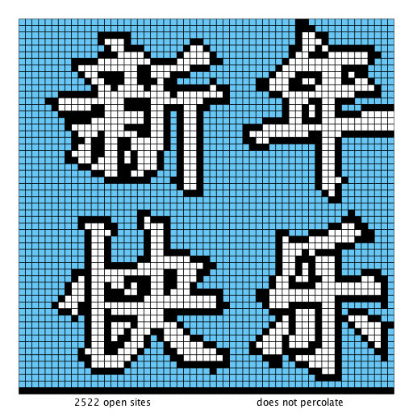
## heart25
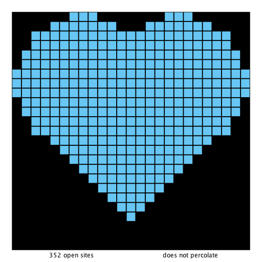
## input10-no

## input10
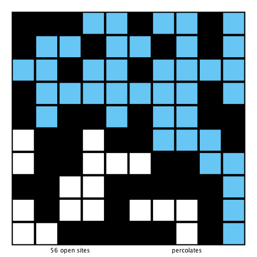
## input1-no
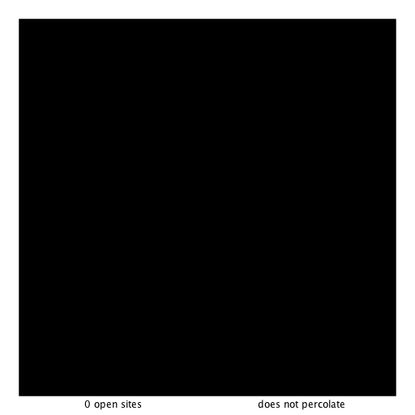
## input1
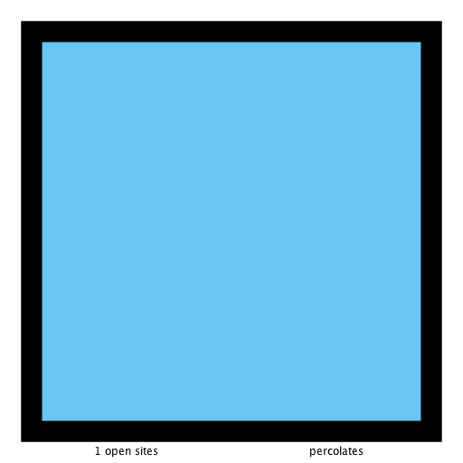
## input20

## input2-no
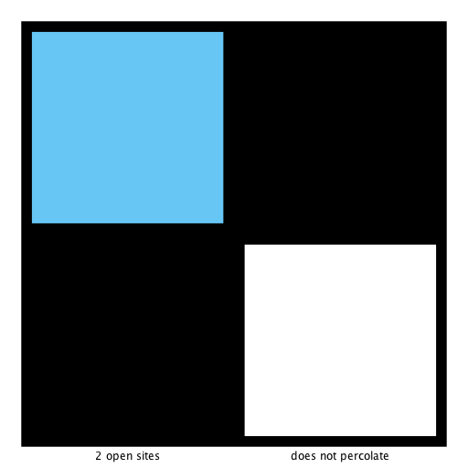
## input2
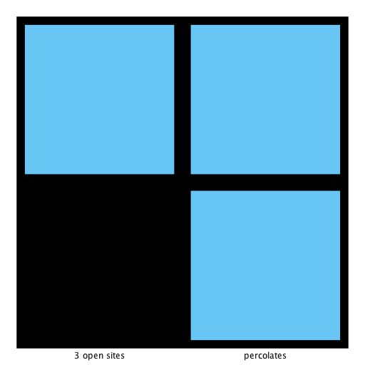
## input3
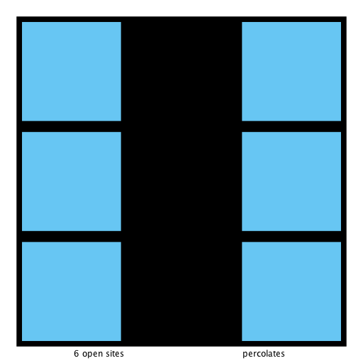
## input4
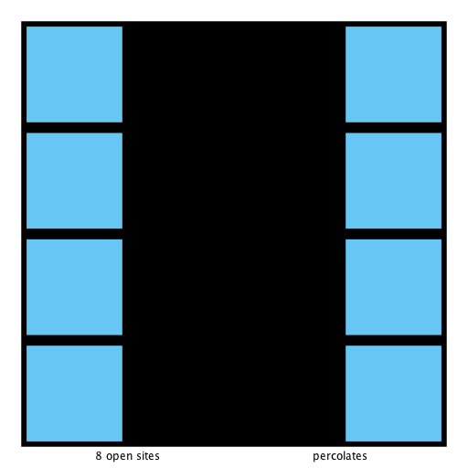
## input50

## input5
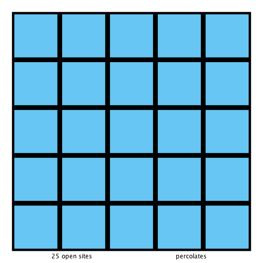
## input6
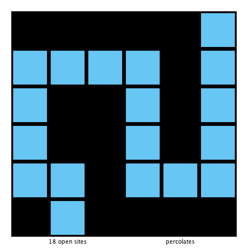
## input7
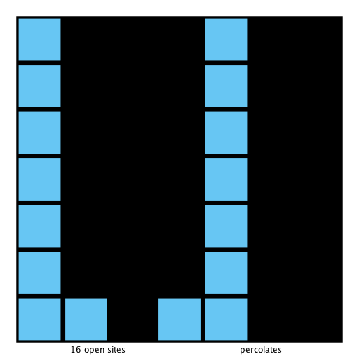
## input8-dups

## input8-no
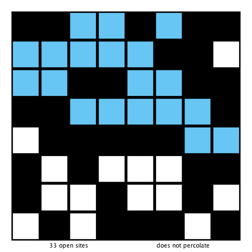
## input8
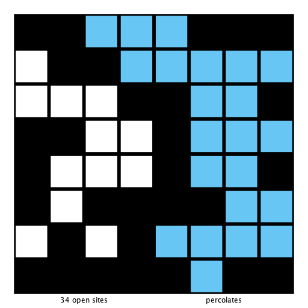
## jerry47

## sedgewick60

## snake101
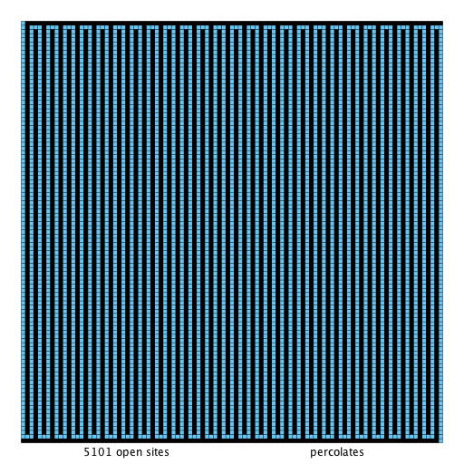
## snake13
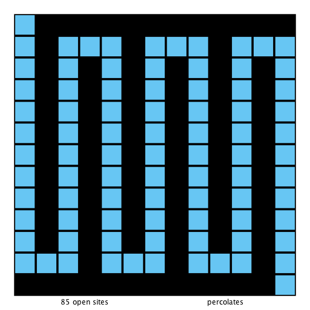
## wayne98
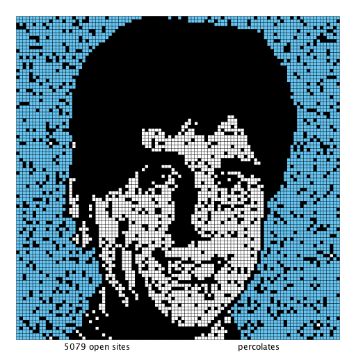
