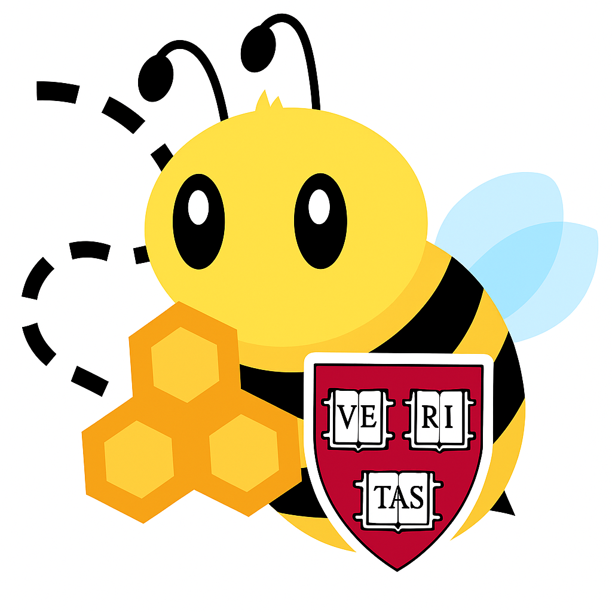



This site is outdated! For the latest content, please visit the <a href="https://fa23.datastructur.es/">Fall 2023 website</a>





This site is under construction. All dates and policies are tentative until this message goes away.



# {{ site.title }}

<!-- ## Announcements

{{ site.announcements.last }} -->

<!-- [Past announcements](announcements.md){: .btn .btn-outline .fs-3 } -->

<!-- **Instructors:** Justin Yokota, Josh Hug / **Lecture:** 1-2PM MWF, VLSB 2050 [Zoom]({{ site.links.lecture }}) -->

## Weekly Schedule

[Skip to current week](#week-{{ 'now' | date: '%U' }}){: .btn .btn-outline .fs-3 }



