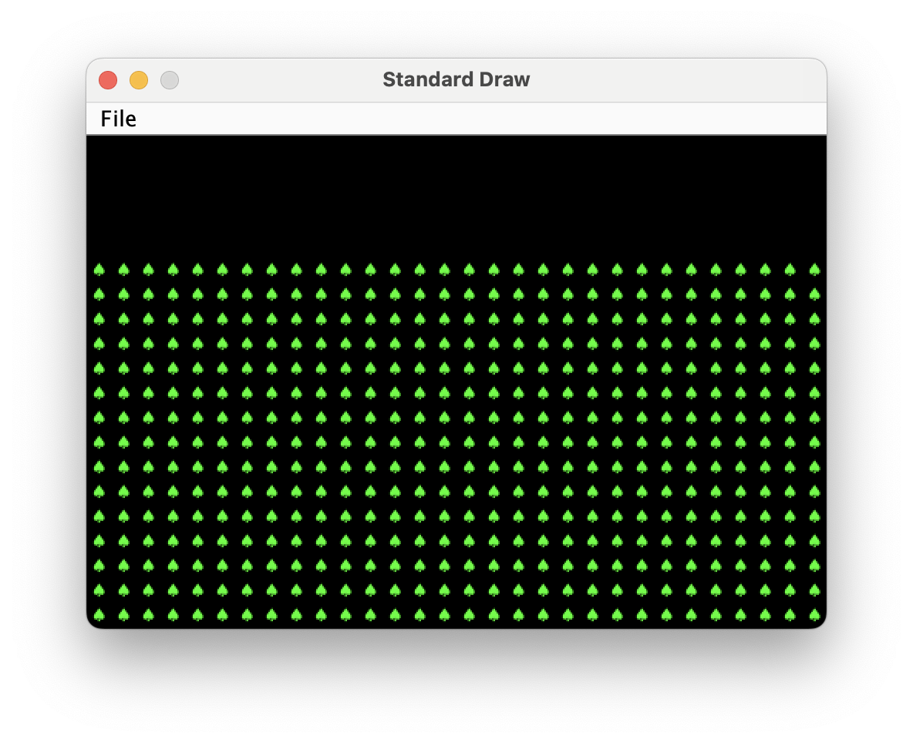
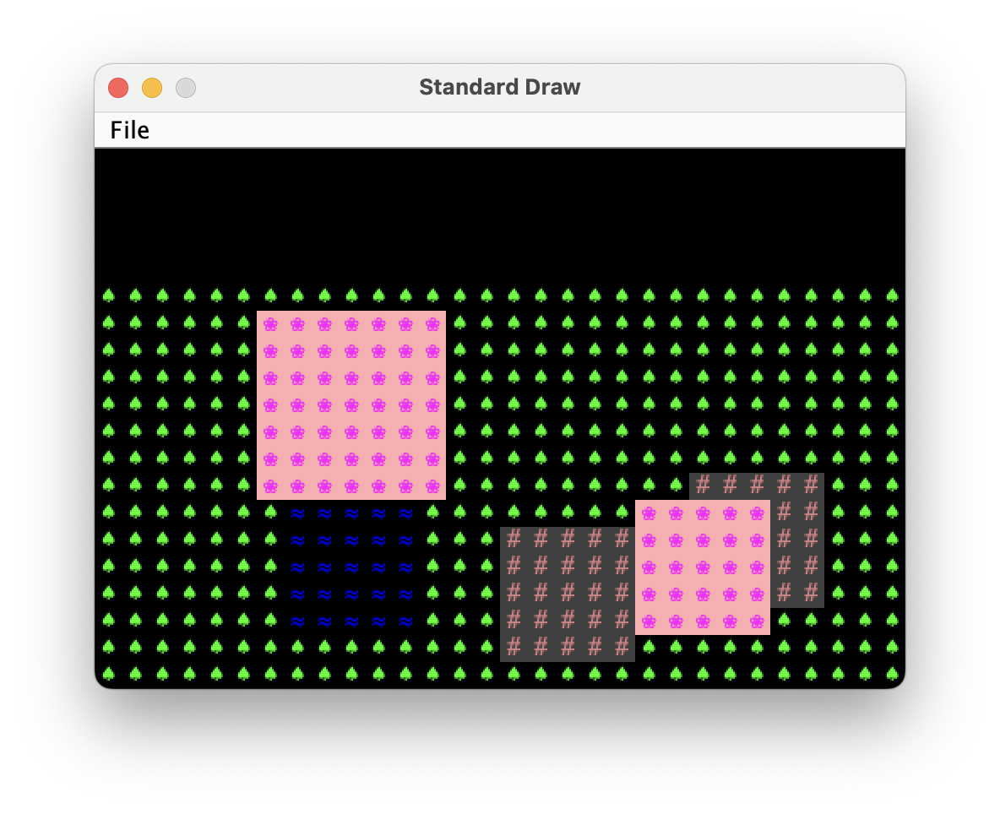

## Introduction

This lab will help you with Project 3: Build Your Own World (BYOW). In this lab, you'll 
learn how to use graphical user interface libraries to render your world and collect
input from the user. 

In the first part of this lab, you'll learn how to use "tiles" to generate shapes on your
screen. This will apply to building the rooms, hallways, and other features of
your world in Project 3. In the second part, you'll add interactivity, drawing boxes
in response to key presses.

## Optional

Please note that this lab is optional but **highly recommended** to help you complete the project! 
The unofficial due date is 4/4 to keep you on track, however feel free to use more time to complete the lab as needed.
As follows, the lab is worth 0 points and there will be no lab sections for this week.

{: .info}
Note that there are some parts labeled below as "Optional". These are additional implementations you can attempt to further test your understanding.

## Pre-Lab

Some steps to complete before getting started on this lab:

- As usual, run `git pull skeleton main`
- Understand that project 3 will be a marathon and not a sprint. Don't wait
  until the last minute. **You and your partner should start thinking about your
  design NOW.**
- Optional: Watch a previous semester's project 3 getting started video [at this link](https://youtu.be/zgdNWICEb_M). The names and API may have changed slightly, but the bigger picture still applies.
- Optional: Read over Phase 1/skim over the [project 3 spec](https://sp25.datastructur.es/projects/proj3/) 
  and understand the main ideas. Spec may not yet be available when you start this lab.

This lab will give you a chance to learn about and practice many of the subtle and tricky parts of project 3, but in the context of a much simpler problem.

## Part I: Meet the Tile Rendering Engine

### Boring World

Open up the skeleton and check out the `BoringWorldDemo` file in the `demo` folder. Try running
it and you should see a window appear that looks like the following:


This world consists of empty space, except for the rectangular block near the
bottom middle. The code to generate this world consists of three main parts:

- Initializing the tile rendering engine.
- Generating a two dimensional `TETile[][]` array.
- Using the tile rendering engine to display the `TETile[][]` array.

Read through the code to see an example of how the tile rendering API works. After creating a `TERenderer`
object, you need to call the `initialize` method, specifying the width
and height of your world, where the width and height are given in terms of the
number of tiles. Each tile is 16 pixels by 16 pixels, so for example, if we
called `ter.initialize(10, 20)`, we'd end up with a world that is 10 tiles wide
and 20 tiles tall, or equivalently 160 pixels wide and 320 pixels tall. 

The code also demonstrates how to work with `TETile` objects. You can either build them from scratch
using the `TETile` constructor (see `TETile.java`), or you can choose from a
palette of pregenerated tiles in the file `Tileset.java`. For example, the code
from `BoringWorldDemo.java` below generates a 2D array of tiles and fills them
with the pregenerated tile given by `Tileset.NOTHING`.

```java
TETile[][] world = new TETile[WIDTH][HEIGHT];
for (int x = 0; x < WIDTH; x++) {
    for (int y = 0; y < HEIGHT; y++) {
        world[x][y] = Tileset.NOTHING;
    }
}
```

Of course, we can overwrite existing tiles. For example, the code below from
`BoringWorld.java` creates a 15 x 5 tile region made up of the pregenerated tile
`Tileset.WALL` and writes it over some of the `NOTHING` tiles created by the
loop code shown immediately above.

```java
for (int x = 20; x < 35; x++) {
    for (int y = 5; y < 10; y++) {
        world[x][y] = Tileset.WALL;
    }
}
```

{: .info}
(0, 0) is the bottom-left corner of the world (not the top-left
as you may be used to). For example, for position (5, 4), we would go 
5 units to the right and then 4 units up. We will work with this orientation
in the lab.

The last step in rendering is to call `ter.renderFrame(world)`, where
`ter` is a `TERenderer` object. Changes made to the tiles array will not appear
on the screen until you call the `renderFrame` method.

Try changing the tile specified to something else in the `Tileset` class other
than `WALL` and see what happens (like `Tileset.GRASS` or `Tileset.WATER`). 
Also, try experimenting with changing the constants in the loop and see 
how the world changes.

{: .warning} 
Tiles themselves are immutable! You cannot do something like
`world[x][y].character = 'X'`. **Look at `TETile` to help understand!**

{: .info}
Why do we initialize the world to `Tileset.NOTHING`, rather than just leaving it
untouched? The reason is that the `renderFrame` method cannot handle any tiles that are `null`. If you don't initialize the world to `Tileset.NOTHING`, you'll
get a `NullPointerException` when you try to call `renderFrame`.

### Task 1: Tree World

Open `Task1.java` in the `Lab9` folder. Complete the following:

 - Fill in the `fillWithTrees(TETile[][] world)` function, which should fill the entire 2D tile array with trees.
 - Fill in the `main` method so that it:
   - Creates and initializes a `TERenderer` of width 30 and height 20.
   - Creates a 2D TETile array of width 30 and height 15, i.e. `TETile[][] world = new TETile[30][15]`
   - Calls `fillWithTrees`
   - Calls `ter.renderFrame(world);`

Run the program and verify that you get an image like the one shown below. Note that because the `TETile[][]` array is height 15 and the world is height 20, 5 empty rows are left blank. We'll use that empty space in task 3.



Note that it's best practice to use constants instead of having numbers hard coded into your declarations, e.g.
`private static final int WORLD_HEIGHT = 15;`, and `new TETile[WORLD_WIDTH][WORLD_HEIGHT];`. This is because
you might want to use these constants in other places, and you don't want to accidentally change it in one place
but not another. For this reason, the style checker will yell at you if you later submit code for project 3 that
looks like `TETile[][] world = new TETile[30][15]`. For this lab, there's nothing to submit, so you don't 
need to worry about this if you don't want to.

### Random World

Now open up `RandomWorldDemo.java`. Try running it and you should see something like this:


This world is sheer chaos -- walls and flowers everywhere! If you look at the `RandomWorldDemo.java` file, you'll
see that we're doing a few new things:

- We create and use an object of type `Random` that is a "[pseudorandom number generator](https://docs.oracle.com/javase/8/docs/api/java/util/Random.html)".
- We use a new type of conditional called a `switch` [statement](https://docs.oracle.com/javase/tutorial/java/nutsandbolts/switch.html).
- We have delegated work to functions instead of doing everything in `main`.

A random number generator does exactly what its name suggests, it produces an
infinite stream of numbers that appear to be randomly ordered. The `Random`
class provides the ability to produce _pseudorandom_ numbers for us in Java.
For example, the following code generates and prints 3 random integers:

```java
Random r = new Random(1000);
System.out.println(r.nextInt());
System.out.println(r.nextInt());
System.out.println(r.nextInt());
```

We call `Random` a _pseudorandom_ number generator because it isn't truly
random. Underneath the hood, it uses cool math to take the previously generated
number and calculate the next number. We won't go into the details of this math,
but see [Wikipedia](https://en.wikipedia.org/wiki/Pseudorandom_number_generator)
if you're curious. **More importantly, the sequence generated is deterministic, and the
way we get different sequences is by choosing what is called a "seed".** This pseudorandomness will be a core part of Project 3. 

In the above code snippet, the seed is the input to the `Random` constructor, so
`1000` in this case. Having control over the seed is pretty useful since it
allows us to indirectly control the output of the random number generator. **If we
provide the same seed to the constructor, we will get the same sequence values.**
For example, the code below prints 4 random numbers, then prints the SAME 4
random numbers again. Since the seed is different from the previous code
snippet, the 4 numbers will likely be different from the 3 numbers printed
above. This **_will be super helpful_** in Project 3, as it will give us deterministic
randomness: your worlds look totally random, but you can recreate them
consistently for debugging (and grading) purposes. 

```java
Random r = new Random(82731);
System.out.println(r.nextInt());
System.out.println(r.nextInt());
System.out.println(r.nextInt());
System.out.println(r.nextInt());
r = new Random(82731);
System.out.println(r.nextInt());
System.out.println(r.nextInt());
System.out.println(r.nextInt());
System.out.println(r.nextInt());
```

In the case a seed is not provided by the user/programmer, i.e.
`Random r = new Random()`, random number generators select a seed using some
value that changes frequently and produces a lot of unique values, such as the
current time and date. Seeds can be generated in all sorts of other stranger
ways, such as
[using a wall full of lava lamps](https://www.popularmechanics.com/technology/security/news/a28921/lava-lamp-security-cloudflare/).

For now, `RandomWorldDemo` uses a hard coded seed, namely `2873123`, so it will
always generate the exact same random world. You can change the seed if you want
to see other random worlds, though given how chaotic the world is, it probably
won't be very interesting.

The final and most important thing is that rather than doing everything in
`main`, **our code delegates work to functions with clearly defined behavior**.
This is critically important for your project 3 experience! You're going to want
to constantly identify small subtasks that can be solved with clearly defined
methods. Furthermore, your methods should form a hierarchy of abstractions!

{: .danger}
At this point, please ensure that you've read through and understood `BoringWorldDemo` 
and `RandomWorldDemo` (important!) and that you understand roughly how to work with 
`TERenderer`, `TETile`, and `Tileset`. It'll be expected for the next parts that you 
have a rough idea of how the first two demo classes work and how to work with the tile 
rendering classes. 

### Task 2A: A square of flowers.

Copy `Task1.java` to create `Task2.java`. Complete the following:

 - Write a function `private static void drawSquare(TETile[][] world, int startX, int startY, int size, TETile tile)`. 
   This function should fill in a square of the given side length made of the given tile. Its top left corner should be
   at position `startX` and `startY`. If the square goes out of bounds, skip any out of bounds tiles, i.e. your
   function shouldn't crash due to an out of bounds error.
 - Modify main so that it calls `drawSquare(world, 10, 7, 5, Tileset.FLOWER);` after the call to `fillWithTrees`. Note,
   you may need to change `world` to match the variable name that you chose.

Running your program, you should see the following.


### Task 2B: Random square locations

In `Task2.java`, complete the following:

 - Write a function `private static void addRandomSquare(TETile[][] world, Random rand)` that uses `drawSquare` to 
   draw a square of flowers of random size between 3 and 7 at a random X and random Y coordinate. It's OK if the 
   square isn't entirely within bounds, though the top left corner should be in bounds. 
 - Modify your `main` function so that it calls `addRandomSquare` instead of the hard coded `drawSquare` above. You should use a hard coded random seed.

Note: If you want random number between 3 and 7, you can use `RandomUtils.uniform(rand, 3, 8);` This function call returns a random integer value in the range [3, 8), i.e. is exclusive of the right end of the range.

Try running your program with different random seeds and you should see different squares get drawn. And if you pick the same random seed, you should see the same square get drawn.

### Task 2C: Random square type

Modify your `Task2.java` code so that the square that gets drawn is either `FLOWER`, `WALL`, or `WATER`, with equal probability. Use a `switch` statement, following the example in the demo code.

### Task 2D: 5 Squares

Modify your `Task2.java` code so that 5 random squares get drawn. An example output is shown below. Note: You will not get the exact world since you didn’t pick the same random seed and implement your code in the exact way that I did.



## Interactivity

In the latter part of the project, you'll need to make your program interactive. Let's see how we can modify the world in response
to key presses. 

Open and run `GameLoopDemo`. Note that when you press 1, 2, 3, 4, or 5, some of the tiles on the screen change. This is done using the
`StdDraw.hasNextKeyTyped` and `StdDraw.nextKeyTyped` methods. 

### StdDraw

As mentioned, we’ll be working with the library `StdDraw`. `StdDraw` is a provided library that gives basic capabilities to create drawings in your program as well as grab user input. Please take a look at the [API](https://introcs.cs.princeton.edu/java/stdlib/javadoc/StdDraw.html) before getting started as you will find some of the methods useful not only for this lab, but for Project 3.

### Task 3A

Create `Task3.java` by copying `Task2.java`. Modify your code so that:

 - Initially there is only a field of trees. That is, delete your five calls to `addRandomSquare`. 
 - When the user presses the `n` key, a new random square is called, i.e. each press of `n` calls `addRandomSquare`.
 - When the user presses the `q` key, the program ends.

You'll need to look closely at `GameLoopDemo`. Importantly, your code should be stuck in an infinite loop, checking for key presses with each iteration.

### Task 3B

Modify your code so that in the blank space that is left empty at the top of the window, we print out the number of squares that are currently being displayed. You can do this using `StdDraw.textLeft(x, y, text)`, which draws the given `text` at the given `x` and `y` position. For example if we pick `x = 1` and `y = 17`, the text will be drawn at the top left of the window. An example is shown below after pressing `n` 5 times. Note: You will not get the exact world since you didn't pick the same random seed and implement your code in the exact way that I did.


If the text is flickering, it's because you're redrawing too many times per second. You can add `StdDraw.pause(2)` to pause for 2 milliseconds at the end of each loop, which will pause after drawing everything to the screen for 2 milliseconds. 

## Task 4 (Optional, but recommended)

You'll also need to implement a save and load feature in project 3. As an example that you can refer to later, let's create a save and load feature for this lab.

Copy `Task3.java` to `Task4.java`. 

Modify your program so that if the user presses `s`, the state of the world is saved. And if the user presses `l`, the state of the world is loaded. There are two things that make this challenging:
 - The save should persist even if the user quits the program completely, turns off their computer, etc.
 - The state of the world isn't just the visible world, but also the state of the random number generator.

Example 1: If you start the program, press `n` 5 times, then press `s`, then `q`, the program will terminate completely. If you then reopen the program and press `l`, you should be exactly where you left off. 

Example 2: If you start the program, press `n` 4 times, then press `s`, then press `n`, then press `l`, you should go back to having 4 rectangles, and importantly, **if you press `n` again** you should get the same pseudo-random 5th rectangle. So if you alternately press `nlnlnlnlnlnlnl`, you should keep seeing the same rectangle appearing and disappearing. The random state is effectively tracked and restored with each press of `l`.

To save state, we recommend writing a file that says how many times `n` has been pressed. For an example of how to read and write from a file, see `ExampleSaveLoad.java`. 

Then when you load state, you should **create a new random number generator (with the same starting seed), blank out the world completely, and call the addRandomSquare function n times**. In effect, you're replaying the sequence of key presses from the start.

There are other ways to do this, such as saving the random number generator object to a file and reloading it, but the simulating-from-scratch approach is much less error prone to implement, especially on the actual much larger project 3.

## Task 5 (Optional, very challenging, similar to project)

As an extra challenge that will more closely resemble the project, add the ability to remove the most recently placed square using `d`. 

Note: If you want the save feature to work properly, you'll need to modify the save/load logic since it's no longer enough to simply know how many squares have been created. That is, if your save file says the number 5, you don't know if that means the user pressed nnnnn (i.e. n 5 times), or if they pressed nnnddnnnndn. One approach is to save the sequence of keypresses to the file.

## Grading and Submission

This lab is worth 0 points. There is nothing to submit.
