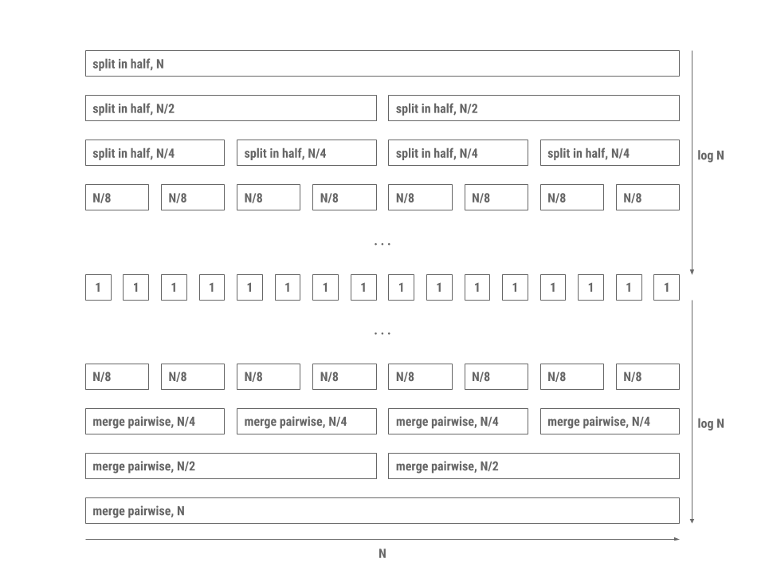

## [FAQ](faq.md)

Each assignment will have an FAQ linked at the top. You can also access it by
adding "/faq" to the end of the URL. The FAQ for Lab11 is located
[here](faq.md).

## Introduction

This lab is optional. You are encouraged to work through it on your own time to strengthen 
your understanding of comparison-based sorting algorithms. There is no in-section component 
or required submission.

As usual, pull the files from the skeleton and make a new IntelliJ project.

In this lab, we'll be discussing **sorting**, algorithms for rearranging elements
in a collection to be in a specific order. There are many problems you can more easily solve with a sorted collection, including performing binary search in $$O(\log N)$$ time,
efficiently identifying adjacent pairs within a list, finding the $$k^{th}$$
largest element, and so forth.

There are several kinds of sorting algorithms, each of which is appropriate for
different situations. At the highest level, we will distinguish between two
types of sorting algorithms:

- **Comparison-based sorts**, which rely on making pairwise comparisons between
  elements.
- **Counting-based sorts**, which group elements based on their individual
  digits before sorting and combining each group. Counting sorts do not need to
  compare individual elements to each other.

In this lab and the following lab, we will discuss several **comparison-based sorts** including
*insertion sort*, *selection sort*, *heap sort*, *merge sort* and *quick sort*. Why all the
different sorts? Each sort has a different set of advantages and disadvantages:
under certain conditions, one sort may be faster than the other, or one sort may
take less memory than the other, and so forth. When working with large datasets
(or even medium and small datasets), choosing the right sorting algorithm can
make a big difference. Along the way, we'll develop an intuition for how each
sort works by exploring examples and writing our own implementations of each
sort.

[Here](https://www.cs.usfca.edu/~galles/visualization/ComparisonSort.html) is a nice
visualizer for some of the sorts. 

## Order and Stability

To put elements in order implies that we can enforce an ordering between any two
elements. Given any two elements in a list, according to **total order**, we
should be able to decide which of the two elements is *larger* or *smaller* than
the other.

However, it's also possible that neither element is necessarily larger or
smaller than the other. For instance, if we wish to determine the ordering
between two strings, `["sorting", "example"]`, and we want to order by the
*length of the string*, it's not clear which one should come first because both
strings are of the same length 7.

In this case, we can defer to the notion of **stability**: if a sort is stable,
then it will preserve the relative orderings between elements in the list. In
the above example then, the resultant array will be `["sorting", "example"]` in
a *stable sort* rather than `["example", "sorting"]` as is possible in an
*unstable sort*. Remember that, according to our total order by the *length of the strings*, the second list is still considered correctly sorted even though
the relative order of equivalent elements is not preserved.

What is the benefit of stable sorting? It allows us to **sort values based off multiple attributes.** For example, we could stably sort a library catalog by
alphabetical order, then by genre, author, etc. Without stable sorting, we are not guaranteed that the relative ordering of the previous sorts
would persist so it is possible that the catalog would only be sorted by our
last sort.

Consider the following example where we sort a list of animals by alphabetical
order and then length of string.

Original collection:

    cow
    giraffe
    octopus
    cheetah
    bat
    ant

First, sort by alphabetical order:

    ant
    bat
    cheetah
    cow
    giraffe
    octopus

Second, **stable** sort by length of string:

    ant
    bat
    cow
    cheetah
    giraffe
    octopus

After the two sort calls on the same list, now the collection is sorted by length and elements with the same length are in
alphabetical order with each other. If our sorting algorithm was not stable,
then we would potentially lose the alphabetical information we achieved in the
previous sort.

## Space Complexity

Thus far, in this class, we've mostly talked about time complexity. Similarly to how we can do asymptotic analysis for runtime, we can also analyze how much *space* (i.e. memory) a given algorithm uses. For sorting algorithms, one common trait we look for is if the algorithm is **in-place**.

Any sorting algorithm that takes in an input of size N is going to have to work with some amount of memory proportional to N to store the size of the input itself. An in-place algorithm is one that doesn't use a significant amount of *additional* memory. In this class, this means that the algorithm must use a constant amount of additional memory (for example, a few variables to keep track of your current index or something). Another way to think about it is if we can do the entire algorithm within the original given list, without creating an additional data structure. All the algorithms we discuss in this lab are in-place and do not need to create another data structure. 

Note that the definition of in-place can vary–though in our class we say only a constant amount of space counts, some measures say using a logarithmic amount is okay. If you see other articles online, just be wary!

## Some Thoughts: Sorting by Hand

Think about how you would sort a hand of 13 playing cards if you
are dealt the cards one-by-one. Your hand should end up sorted first by suit,
and then by rank within each suit.

Then, think about how you would sort a pile of 300 CS 61BL exams by student ID. If
it's different than your card-sorting algorithm of the previous step, explain
why.

Can you tell if one is faster than the other? How so?

## Insertion Sort

The first comparison-based sort we'll learn is called an *insertion sort*. The
basic idea for insertion sort can be formally summed up by this pseudocode: 

    for each element in the collection:
        while the previous element is smaller than the element:
            swap the two elements

You might have intuitively come up with insertion sort when we asked you how to sort cards. This is like when you sort cards by continually putting the next card in the right spot in a group of sorted cards that you're holding.

Note that insertion sort is stable. We never swap elements if they are equal so
the relative order of equal elements is preserved.

Now that you've read the above explanation, we recommend watching this [video](https://youtu.be/JtS5yGftYZ8) to solidify your understanding.

### Thought Exercise: Runtime

For the following questions, think on your own and then verify your
answers.

Assume we have an array of $$N$$ integers. What would the array have to look
like before we ran insertion sort that would make insertion sort run the
fastest, i.e. minimizing the number of steps needed?

 Click to reveal answer! 

Sorted List

What is the runtime of running insertion sort on this array?

 Click to reveal answer! 

Theta(N)

What type of initial ordering of a list would maximize the number of comparisons and result in the slowest runtime?

 Click to reveal answer! 

Reverse Sorted Array

What is the runtime of running insertion sort on the type of array you identified above?

 Click to reveal answer! 

Theta(N^2)

### Non-Coding Exercise: `InsertionSort`

Read the solution `sort()` in `InsertionSort.java` and understand the provided helper methods.

## Selection Sort

Selection sort on a collection of $$N$$ elements can be described by the
following pseudocode:

    for each element in the collection:
        find the smallest remaining element, E, in the *unsorted* part of the array
        remove E and add E to the end of the *sorted* part of the array
        repeat unsorted collection's original length number of times (or repeat until unsorted collection has no more elements)

In selection sort we swap the minimum element in the unsorted
collection with the element at the beginning of the unsorted collection. This can
rearrange the relative ordering of equal elements. Thus, selection sort is
unstable.

After reading the above, we recommend watching this [video](https://youtu.be/yZtvSYeTQi4) on selection sort!

### Disussion: Runtime

Now, let's determine the asymptotic runtime of selection sort. One may observe
that, in the first iteration of the loop, we will look through all $$N$$
elements of the array to find the minimum element. On the next iteration, we
will look through $$N - 1$$ elements to find the minimum. On the next, we'll
look through  $$N - 2$$ elements, and so on.  Thus, the total amount of work
will be the $$N + (N - 1) + ... + 1$$, no matter what the ordering of elements
in the array or linked list prior to sorting.

Hence, we have an $$\Theta(N^2)$$ algorithm, equivalent to insertion sort's
normal case. But notice that selection sort *doesn't* have a better case, while
insertion sort does.

### Non-Coding Exercise: `SelectionSort`

Read the solution to `sort()` and understand the helper methods in `SelectionSort.java`.

## HeapSort

Recall the basic structure for selection sort

    for each element in the collection:
        find the smallest remaining element, E, in the unsorted collection
        remove E and add E to the end of the sorted collection

Adding something to the end of a sorted array or linked list can be done in
constant time. What hurt our runtime was finding the smallest element in the
collection, which always took linear time in an array.

Is there a data structure we can use that allows us to find and remove the
smallest element quickly? A heap will! 

We'll modify our approach to make it better suited for a heap by removing the 
largest element and placing it at the end of the array. Here's the pseudocode for 
HeapSort:
   
    construct a max heap from the given collection by bubbling down every
    element from the end of the collection 
    while there are elements remaining in the heap (unsorted part of the collection)
        swap the root of the heap with the last element
        bubble down the new root till the end of the heap

HeapSort is not stable because the heap operations (recall `bubbleUp` and
`bubbleDown`) can change the relative order of equal elements.

Once again, wrap up learning about HeapSort with this helpful [video](https://youtu.be/WuuQqsDftGU).

### Disussion: Runtime

Now, let's determine the runtime of heap sort. Removal of the largest element from a
heap of $$N$$ elements can be done in time proportional to $$\log N$$, allowing
us to sort our elements in $$O(N \log N)$$ time. 
We can also build a heap in $$O(N \log N)$$ time by calling bubble down on every element. 
This step is only done once, so it doesn't make our overall runtime worse than $$O(N \log N)$$
that we previously established. So, once the heap is created, sorting can be
done in $$O(N \log N)$$.

 Out of scope note:

The tighter runtime for building the heap is actually O(N) but it doesn't affect the 
overall runtime. The actual calculation for the run time of heap sort is complicated and out
of scope for this class. You can take a look at this <u><a href="https://stackoverflow.com/a/18742428">stackoverflow answer</a></u> for more a formal calculation of this runtime.

### Exercise: `HeapSort`

Complete `sort()` and suggested helper methods in `HeapSort.java`. The heap in this lab is rooted at index 0 instead of 1 as we're using it to sort through a pre-existing array. 
We've provided the appropriate `getLeftChild` and `getRightChild` methods as part of the skeleton, so you don't have to worry about this in your implementation. 

## New Idea: "Divide and Conquer"

The first few sorting algorithms we've previously introduced work by iterating through each
item in the collection one-by-one. With insertion sort and selection sort, both
maintain a "sorted section" and an "unsorted section" and gradually sort the
entire collection by moving elements over from the unsorted section into the
sorted section. Another approach to sorting is by way of *divide and conquer*.
Divide and conquer takes advantage of the fact that empty collections or
one-element collections are already sorted. This essentially forms the base case
for a recursive procedure that breaks the collection down into smaller pieces
before merging adjacent pieces to form a completely sorted
collection.

The idea behind divide and conquer can be broken down into the following 3-step
procedure.

1. Split the elements to be sorted into two collections.
2. Sort each collection recursively.
3. Combine the sorted collections.

Compared to selection sort, which involves comparing every element with *every
other element*, divide and conquer can reduce the number of unnecessary
comparisons between elements by sorting or enforcing order on sub-ranges of the
full collection. The runtime advantage of divide and conquer comes largely from
the fact that merging already-sorted sequences is very fast.

Two algorithms that apply this approach are *merge sort* and *quicksort*.

## Merge Sort

Merge sort works by executing the following procedure until the base case of an
empty or one-element collection is reached.

1. Split the collection to be sorted in half.
2. Recursively call merge sort on each half.
3. Merge the sorted half-lists.

The reason merge sort is fast is because merging two lists that are already
sorted takes linear time proportional to the sum of the lengths of the two
lists. In addition, splitting the collection in half requires a single pass
through the elements. The processing pattern is depicted in the diagram below.

Each level in the diagram is a collection of processes that all together run in
linear time. Since there are $$2 \log N$$ levels with each level doing work
proportional to $$N$$, the total time is proportional to $$N \log N$$.

To be specific, each level does work proportional to $$N$$ because of the merging process, 
which happens in a zipper-like fashion. Given two sorted lists, `merge` should continually
compare the first elements of both lists and interweave the elements into a singular sorted list.
For example, given the lists [2, 6, 7] and [1, 4, 5, 8], `merge` compares the front of both lists (1 and 2). Because
1 < 2, 1 is moved into the next open spot (in this case, the first position) of the overall sorted list. Note
that 2 does not enter the overall list, because we now must effectively compare [2, 6, 7] with [4, 5, 8] and repeat the process
until there are no more elements that need to be compared and merged.

Merge sort is stable as long as we make sure when merging two halves together
that we favor equal elements in the left half.

Now, watch [this video](https://youtu.be/JJrAzmJcMh0) on `mergeSort` before attempting the exercise below!

## Exercise: `mergeSort`

To test your understanding of merge sort, fill out the `sort` method in
`MergeSort.java`. Be sure to take advantage of the helper `merge` method!

This method should be non-destructive, so the original `int[] arr` should not be
modified.

## Quicksort

Another example of dividing and conquering is the *quicksort* algorithm, which
proceeds as follows:

1. Split the collection to be sorted into three collections by *partitioning*
   around a *pivot* (or "divider"). One collection consists of elements smaller
   than the pivot, the second collection consists of elements equal to the
   pivot, and the third consists of elements greater than or equal to the pivot.
2. Recursively call quicksort on each collection.
3. Merge the sorted collections by concatenation.

Specifically, this version of quicksort is called "three-way partitioning
quicksort" due to the three partitions that the algorithm makes on every call.

Here's an example of how this might work, sorting an array containing 3, 1, 4,
5, 9, 2, 8, 6.

1. Choose 3 as the pivot. (We'll explore how to choose the pivot shortly.)
2. Put 4, 5, 9, 8, and 6 into the "large" collection and 1 and 2 into the
   "small" collection. No elements go in the "equal" collection.
3. Sort the large collection into 4, 5, 6, 8, 9; sort the small collection into
   1, 2; combine the two collections with the pivot to get 1, 2, 3, 4, 5, 6, 8,
   9.

Depending on the implementation, quicksort is not stable because when we move
elements to the left and right of our pivot the relative ordering of equal
elements can change.

Before moving on to the next part of the lab, check out [this video](https://www.youtube.com/watch?v=7cjXkEW1STY&t=1h24m55s) to solidify your understanding of quicksort. Note this was taken from summer 2021's lecture, so you can stop after the section on quicksort. That is, you can stop at 1:41:00. 

## Exercise: `quicksort`

To test your understanding of quicksort, fill out the `sort` method in
`QuickSort.java`. Be sure to take advantage of the helper `partition` method!

This method is destructive, where the original `int[] arr` should be
modified.

## Though Exercise: Quicksort

### Thought Exercise 1: Runtime

First, let's consider the best-case scenario where each partition divides a
range optimally in half. Using some of the strategies picked up from the merge
sort analysis, we can determine that quicksort's best case asymptotic runtime
behavior is $$O(N \log N)$$. Think about why this is the case, and
any differences between quicksort's best case runtime and merge sort's runtime.

However, quicksort is faster in practice and tends to have better constant
factors (which aren't included in the big-Oh analysis). To see this, let's
examine exactly how quicksort works.

We know concatenation for linked lists can be done in constant time, and for arrays it can be done in linear time.
Partitioning can be done in time proportional to the number of elements $$N$$. 
If the partitioning is optimal and splits each range more or less in half,
we have a similar logarithmic division of levels downward
like in merge sort. On each division, we still do the same linear amount of work
as we need to decide whether each element is greater or less than the pivot.

However, once we've reached the base case, we don't need as many steps to
reassemble the sorted collection. Remember that with merge sort, while each list
of one element is sorted, the entire set of one-element
lists is not necessarily in order, which is why there are $$\log N$$ steps to
merge upwards in merge sort. This isn't the case with quicksort as each element
*is* in order. Thus, merging in quicksort is simply one level of linear-time
concatenation.

Unlike merge sort, quicksort has a worst-case runtime different from its
best-case runtime. Suppose we always choose the first element in a range as our
pivot. Then, which of the following conditions would cause the worst-case
runtime for quicksort? Think about it, then verify your understanding
by highlighting the line below for the answer.

<em>Sorted or Reverse Sorted Array. This is because
  the pivot will always be an extreme value (the largest or smallest unsorted value)
  and we will thus have N recursive calls, rather than log(n).</em>

What is the runtime of running quicksort on this array?

<em>Theta(N^2)</em>

Under these conditions, does this special case of quicksort remind you of any
other sorting algorithm we've discussed in this lab?

We see that quicksort's worst case scenario is pretty bad... You might be wondering why we'd even bother with it then! However, though it's outside the scope of this class for you to prove why, we can show that on *average*, quicksort has $$O(N \log(N))$$ runtime! In practice, quicksort ends up being very fast.

### Thought Exercise 2: Choosing a Pivot

Given a random collection of integers, what's the best possible choice of pivot
for quicksort that will break the problem down into $$\log N$$ levels? Try to describe an algorithm 
to find this pivot element. What is its runtime? It's okay if you think your solution isn't the most efficient.

## Quicksort in Practice

How fast was the pivot-finding algorithm that you came up with? Finding the
exact median of our elements may take so much time that it may not help the
overall runtime of quicksort at all. It may be worth it to choose an approximate
median, if we can do so really quickly. Options include picking a random
element, or picking the median of the first, middle, and last elements. These
will at least avoid the worst case we discussed above.

In practice, quicksort turns out to be the fastest of the general-purpose
sorting algorithms we have covered so far. For example, it tends to have better
constant factors than that of merge sort. For this reason, Java uses this
algorithm for sorting arrays of **primitive types**, such as `int`s or `float`s.
With some tuning, the most likely worst-case scenarios are avoided, and the
average case performance is excellent.

Here are some improvements to the quicksort algorithm as implemented in the Java
standard library:

- When there are only a few items in a sub-collection (near the base case of the
  recursion), insertion sort is used instead.
- For larger arrays, more effort is expended on finding a good pivot.
- Various machine-dependent methods are used to optimize the partitioning
  algorithm and the `swap` operation.
- [Dual pivots](https://www.geeksforgeeks.org/dual-pivot-quicksort/)

For **object types**, however, Java uses a hybrid of *merge sort and insertion
sort* called "Timsort" instead of quicksort. Can you come up with an explanation
as to why? *Hint*: Think about stability!
 

To learn more about the performance difference between Quicksort and Mergesort, watch this video [Quicksort versus Mergesort](https://www.youtube.com/watch?v=es2T6KY45cA)

### Timing

So far we've measured the speed and efficiency of our algorithms by theoretically
performing asymptotic analysis on them. Another (less formal) way of determining 
the speed of a given program is to test it on a variety of inputs and measure 
the time it takes for each one. This is called a timing experiment, and we 
refer to this process as finding the efficiency of a program empirically. 
In this lab, we will be doing some timing experiments to see how the different sorting 
classes you implemented in this lab perform.

Open `TimingTest.java` and run it's `main` method. This class will sort random arrays of
different sizes using the sorting algorithms you implemented and plot the results. 

Here's the result of running the test on one of our computers:

Notice how by the time we reach an array size of 1000000, Selection Sort and Insertion Sort 
take more than a minute to run while Heap Sort and Merge Sort manages to sort the same array in just over
one-tenth of a second!  

If you run it multiple times, you will also notice that Quicksort's runtime varies more than others---you are seeing
the different pivot's runtime on this algorithm's performance in action! 

Please note that the result you see my be different from the picture above. 
If the tests are taking too long on your computer, try lowering the bounds provided in the class.

## Summary

In this lab, we learned about more comparison-based algorithms for sorting
collections. Within comparison-based algorithms, we examined two different
paradigms for sorting:

1. Simple sorts like **insertion sort** and **selection sort** which
   demonstrated algorithms that maintained a sorted section and moved unsorted
   elements into this sorted section one-by-one. With optimization like **heapsort** or the right conditions (relatively sorted list in the case of insertion
   sort), these simple sorts can be fast!
2. Divide and conquer sorts like **merge sort** and **quicksort**. These
   algorithms take a different approach to sorting: we instead take advantage of
   the fact that collections of one element are sorted with respect to
   themselves.  Using recursive procedures, we can break larger sorting problems
   into smaller subsequences that can be sorted individually and quickly
   recombined to produce a sorting of the original collection.

Here are several online resources for visualizing sorting algorithms. If you're
having trouble understanding these sorts, use these resources as tools to help
build intuition about how each sort works.

- [VisuAlgo][]
- [Sorting.at][]
- [Sorting Algorithms Animations][]
- [USF Comparison of Sorting Algorithms](http://www.cs.usfca.edu/~galles/visualization/ComparisonSort.html)
- [AlgoRhythmics][]: sorting demos through folk dance including
  [insertion sort][], [selection sort][], [merge sort][], and [quicksort][]

[VisuAlgo]: http://visualgo.net/sorting
[Sorting.at]: http://sorting.at/
[Sorting Algorithms Animations]: http://www.sorting-algorithms.com/
[USF Comparison of Sorting Algorithms]: http://www.cs.usfca.edu/~galles/visualization/ComparisonSort.html
[AlgoRhythmics]: https://www.youtube.com/user/AlgoRythmics/videos
[insertion sort]: https://www.youtube.com/watch?v=ROalU379l3U
[selection sort]: https://www.youtube.com/watch?v=Ns4TPTC8whw
[merge sort]: https://www.youtube.com/watch?v=XaqR3G*NVoo
[quicksort]: https://www.youtube.com/watch?v=ywWBy6J5gz8

To summarize the sorts that we've learned, take a look at the following table. 

|                | Best Case Runtime    | Worst Case Runtime   | Stable  | In Place | Notes |
|----------------|----------------------|----------------------|---------|----------|-------|
| [Insertion Sort](https://youtu.be/JtS5yGftYZ8) | $$\Theta(N)$$        | $$\Theta(N^2)$$      | Yes     | Yes | |
| [Selection Sort](https://youtu.be/yZtvSYeTQi4) | $$\Theta(N^2)$$      | $$\Theta(N^2)$$      | No      | Yes | Can be made stable under certain conditions. |
| [Heap Sort](https://youtu.be/WuuQqsDftGU)      | $$\Theta(N \log N)$$ | $$\Theta(N \log N)$$ | No      | Yes | If all elements are equal then runtime is $$\Theta(N)$$. Hard to make stable. |
| [Merge Sort](https://youtu.be/JJrAzmJcMh0)     | $$\Theta(N \log N)$$ | $$\Theta(N \log N)$$ | Yes     | Not usually. Typical implementations are not, and making it in-place is terribly complicated. | An optimized sort called "Timsort" is used by Java for arrays of reference types. |
| [Quicksort](https://www.youtube.com/watch?v=7cjXkEW1STY&t=1h24m55s)      | $$\Theta(N \log N)$$ | $$\Theta(N^2)$$      | Depends | Most implementations use log(N) additional space for the recursive stack frames | Stability and runtime depend on partitioning strategy; three-way partition quicksort is stable. If all elements are equal, then the runtime using three-way partition quicksort is $$\Theta(N)$$. Used by Java for arrays of primitive types. Fastest in practice. |

> You may have noticed that there seems to be a lower bound on how fast our sorting algorithms can go. For *comparison* based sorts, we can prove the best we can do is $$O(N\log(N))$$. You can watch a very brief video explanation [here](https://www.youtube.com/watch?v=j4Lmzhs6r-Y&list=PLNF4Mv5EsHj4QLTEw3uz42vJGKblD9usL&index=3) at timestamp 11:42. You can also read a more in-depth [proof](https://www.cs.cmu.edu/~avrim/451f11/lectures/lect0913.pdf), if you're into that kind of thing. There are also *counting* sorts, which can do even better when we're able to use them.

### Deliverables

To get credit for this lab:
- Complete the following classes:
    - `HeapSort.java`
    - `MergeSort.java`
    - `QuickSort.java`
