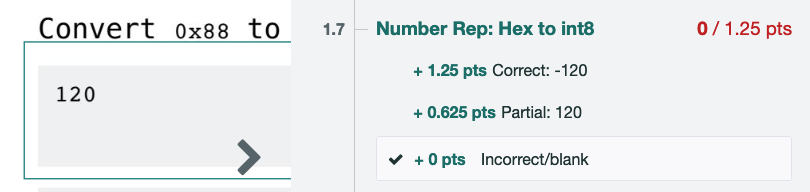

## Exam Times

There will be two midterms and a final exam:

- Midterm 1: Thursday, February 20, 8–10pm PT
- Midterm 2: Wednesday, April 2, 8–10pm PT
- Final Exam: Tuesday, May 13, 8–11am PT

There are **no remote exams** this semester. All exams (including alternate exams) will be held in-person.

## Alternate Exam Times

If you are unable to take the exam at the scheduled time, we will be offering only one alternate exam time per exam, in-person only.

- Alternate Midterm 1: Thursday, Februrary 20, 6–8pm PT
- Alternate Midterm 2: Wednesday, April 2, 6-8pm PT 
- Alternate Final Exam: Tuesday, May 13, 11am–2pm PT

There are no other alternate exam times.

We are only offering the alternate exam time if you are unable to take the exam at the normal time for verifiable time conflicts. For example, if you have another exam at the same time, you can take the alternate-time exam. However, wanting a break between non-conflicting exams would not be a valid reason to take the alternate-time exam, because in this case you are able to take the exam at the normal time.

We'll release a form closer to the exams for you to sign up for an alternate-time exam.

If you are unable to attend the normal exam or the alternate-time exam (e.g. because of sickness), please email cs61b@berkeley.edu.

## Exam Clobbering

For those of you who miss an exam, have a bad night, or make major improvements over the semester, the exam clobbering policy gives you a chance to replace one or both of your midterm exam scores.

You don't need to understand the math behind the clobber policy, but we've described the computation steps below for transparency:

{: .info }
> Exam clobbering formulas. You do not need to understand anything in this box.
>
> 1. Compute your z-score on the final exam:
> 
>     $$\text{final exam z-score} = \frac{(\text{your final exam score} \ – \ \text{final exam mean})}{\text{final exam standard deviation}}$$
> 
> 2. Compute the equivalent score on the midterm distribution:
> 
>     $$\text{scaled midterm score} = (\text{final exam z-score} \times \text{midterm standard deviation}) + \text{midterm mean}$$
> 
> 3. Your midterm score is:
> 
>     $$\max(\text{your midterm score}, \text{scaled midterm score})$$
> 
> 4. Repeat Steps 1–3 for both midterms.

## Exam Curving

Our exams are intended to have an average score of 65%. If the exam is too difficult, and the class average score is below 65%, we will curve everyone's scores so that the average score is 65%.

If the average score is at or above 65%, then we will not change scores (i.e. your score will not decrease).

You don't need to worry about the specific calculations for grade curving, but we've described the calculations below for transparency:

{: .info }
> Exam curving formulas. You do not need to understand anything in this box.
>
> To compute curved scores, we will reduce the maximum score on the exam until the average score is 65%.
> 
> The reduced maximum score turns out to be $$\text{mean score} / 0.65$$.
> 
> Here are some examples of computing the curve:
> 
> 1. Suppose we have a class with 3 students, and their exam scores are: $$40/100$$, $$50/100$$, and $$60/100$$.
> 
>    The class average is $$\frac{40 + 50 + 60}{3}$$ = 50%. This means our exam was too difficult.
> 
> 2. To change the average score to 65%, we will reduce the maximum score. Instead of counting the exam out of 100 points, we will count the exam out of $$50 / 0.65$$ = 76.9 points.
> 
> 3. Using the reduced max score, the students' new exam scores are now: $$40/76.9$$, and $$50/76.9$$, and $$60/76.9$$.
> 
>     As percentages, these scores are: 52%, 65%, and 78%.
> 
>     The average of these scores is now 65%!

For each exam, we will officially announce the reduced max score after exam regrades are processed, so that you can compute your own curved exam score.

## Exam Scaling

Each exam is scored out of 100 points, but we will scale your score up to be out of 100 (midterm 1), 150 (midterm 2), and 250 (final exam) course points when we compute your final letter grade.

The maximum score on an exam is 100%. If your score exceeds 100% after curving, it will be capped at 100% when calculating grades.

Points earned above 100% can be used to increase your grade from an A to an A+, but will not be used in any other grade calculations.

## Exam Score Computation Formula

We know that exam scores with clobber and curve aren't the easiest thing to compute. Remember, you don't need to know any of this math, and you can totally ignore this section if you want – we will automatically compute the correct exam score for you!

That said, if you want to compute your own score, we've provided the exact formulas here for your reference.

{: .info }
> Exam score computation formulas. You do not need to understand anything in this box.
>
> Intutively, the clobber changes the numerator of your score, and the curve changes the denominator of your score. After applying the clobber and curve, we scale your score and cap it at 100% if needed.
> 
> For the final exam (can't be clobbered), skip steps 1–3.
> 
> If computing a midterm score before the final exam (no clobber available yet), skip steps 1–3.
> 
> 1. [Clobber] Compute your z-score on the final exam:
> 
>     $$\text{final exam z-score} = \frac{(\text{your score} \ – \ \text{final exam mean})}{\text{final exam standard deviation}}$$
> 
>     In the formula, your score, the final exam mean, and the final exam standard deviation are all taken directly from Gradescope and are out of 100 points.
> 
> 2. [Clobber] Compute the equivalent score on the midterm distribution:
> 
>     $$\text{scaled midterm score} = (\text{final exam z-score} \times \text{midterm standard deviation}) + \text{midterm mean}$$
> 
>     In the formula, the midterm mean, midterm standard deviation, and your scaled midterm score are all out of 100 points. The midterm mean and standard deviation are taken directly from Gradescope.
> 
> 3. [Clobber] Your clobbered midterm score is:
> 
>     $$\text{clobbered midterm score} = \max(\text{your midterm score}, \text{scaled midterm score})$$
> 
>     This is the numerator of your score fraction.
> 
> 4. [Curve] Compute the reduced max score. (The official reduced max score will be announced by staff, but you can use this formula to estimate.)
>
>     $$\text{reduced max} = \frac{\text{exam mean}}{0.65}$$
>
>     In the formula, the exam mean is out of 100 points.
> 
>     This is the denominator of your score fraction.
> 
> 5. Compute your score.
> 
>     The denominator is always from Step 4.
> 
>     If computing a midterm score with clobber, the numerator is from Step 3:
> 
>     $$\text{curved and clobbered exam score} = \frac{\text{clobbered midterm score}}{\text{reduced max}}$$
> 
>     If computing a final exam score (can't be clobbered), or computing a midterm score before the final exam (no clobber available yet), the numerator is just your raw exam score out of 100:
> 
>     $$\text{curved and clobbered exam score} = \frac{\text{raw exam score}}{\text{reduced max}}$$
> 
> 6. [Scale] You now have a clobbered, curved midterm score out of 100 points.
> 
>     The last step is to scale this score up to the number of course points (out of 1000) the exam is worth:
> 
>     Midterm 1 (worth 100 points): $$\text{course points} = \text{curved and clobbered exam score} \times 100$$
> 
>     Midterm 2 (worth 150 points): $$\text{course points} = \text{curved and clobbered exam score} \times 150$$
> 
>     Midterm 3 (worth 250 points): $$\text{course points} = \text{curved and clobbered exam score} \times 250$$
> 
>     If the score you compute is greater than 100% (e.g. 160/150 on Midterm 2), round your score down to the maximum (e.g. round down to 150/150). Any excess points get converted to "exam bonus points", which only gets used to determine A+s. 

## Regrade Request Policy

If you think we made a mistake when grading your exam, you can request a regrade through Gradescope.

You should only request a regrade if there is a rubric item that clearly applies to your answer. For example:

In this case, your answer is eligible for the "Partial: 120" rubric item, so you can request a regrade request.

However, if you answered "–121", this is not on the rubric. If you request a regrade asking for partial credit, it will be denied.

If you want to ask for credit for something that's not on the rubric, you should ask publicly on Ed. A good rule of thumb is: If regrading your answer would change the rubric for everybody else, you should post on Ed.

Note on partial credit: To minimize the effect of random guessing on exam scores, we are stricter than other classes when it comes to partial credit:
- An answer that is fully correct except for one very minor mistake is usually worth half-credit.
- An answer with 2 or more minor mistakes is usually not worth credit.
- An answer showing conceptual misunderstanding is usually not worth credit. Similarly, an answer where we cannot distinguish between a conceptual misunderstanding and a typo is usually not worth credit.

Asking for more partial credit is not going to be very helpful. Remember, we curve the exam to a target average of 65%, so when we hand out less partial credit, it also means you get more of a grade bump from the curve. If we gave more partial credit, the curve would end up being less generous, and your overall grade wouldn't be much different.

Some other logistical policies on regrade requests:
- We only respond to regrade requests after the deadline for submitting them.
- If we spot another mistake in the process of regrading your submission, we will fix it, even if your grade goes down. Please request responsibly! If you flood us with frivolous requests or requests that don't follow the rules (e.g. "can I have partial credit for this thing that's not on the rubric"), we're more likely to find something else and decrease your score.
