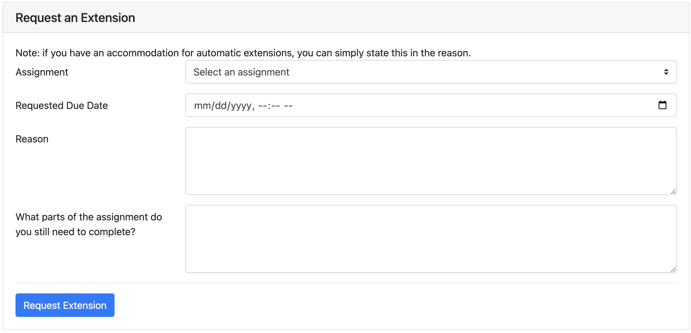
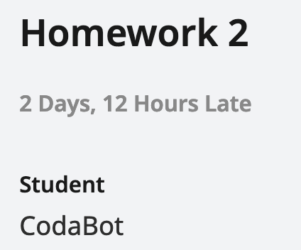

## Deadline Philosophy

61B is a fast-paced course, especially in the first few weeks. If you fall behind, it will be very difficult to catch up.

However, we understand that you may be busy, tired, or experiencing a crisis, or that you may have occasional one-off conflicts like performances to attend, waves to surf, etc. We would like your grade to reflect what you demonstrate proficiency in and accomplish in the class, and have designed some flexibility to our lateness policy to achieve that as much as possible. Your health, safety, and well-being are the priority, and ideally your grades should reflect what you have learned, not when you learned it.

Our extensions policy trusts that you are adults who can handle your own time management, while understanding that some firmness in the deadlines may be necessary to keep you on track. If you request an extension, we trust that you understand that you will need to spend extra time to catch up with the class.

<!-- Our deadlines are set up to give you time before midterms to study (with no other assignments due). They are also set up so that you are not expected to work over weekends, holidays (e.g. Thanksgiving break), or RRR week. If you request too many extensions and fall behind, this may no longer be true, but that's your prerogative. -->

Leading up to an assignment deadline, we usually provide increased support for that assignment (in the form of increased staffing). As a result, continuing to work on an assignment after the original deadline may lead to slower response times on Ed/longer wait times in office hours, as staff will actively prioritize assignments whose deadlines have not passed.

## How to Request Extensions

1. Navigate to the extensions page on [Beacon]({{ site.links.beacon }}/extensions).
2. In the "Requesting an Extension" form, fill out each field and click "Submit".

   

3. We'll respond to your request in 1–2 business days.

### Long Extensions
If you are planning to request for an extension that is **more than 7 days**, please fill out the 
[extenuating circumstances form]({{site.links.extenuating_circumstances}}) and **do not** request for an extension on beacon. 

## Extenuating Circumstances

If you experience significant extenuating circumstances that prevent you from completing assignments for an extended amount of time, and you think that the extensions system is not enough to support you, then you can fill out the [**extenuating circumstances form**]({{site.links.extenuating_circumstances}}) to let us know and request for more accommodations. You should also fill out this form if you intend to request for an extension that is longer than 7 days, as mentioned above. 

Some examples of extenuating circumstances include: Extended sickness, technical issues (broken laptop), family emergency, etc.

If you would like to meet with a staff member and discuss your situation in more detail, feel free to sign up for a student support meeting [here]({{site.links.student_support_meetings}}).

## Student Support Meetings
Student support meetings are 20 minutes, online one-on-one meetings where you can speak to a staff member about DSP accommodations, extenuating circumstances, long extensions (> 7 days), or general advice and support resources for success in the course. 

[You can book an appointment with us here]({{site.links.student_support_meetings}}), or by clicking on the “student support” tab at the upper right hand corner of the course website’s home page.

## Processing Extensions

Extensions are **not** always reflected on Gradescope. You might see your assignment tagged as late on Gradescope, like this:

You can ignore that tag. The autograder score you see on Gradescope is your score for the assignment. The "2 Days, 12 Hours Late" tag does not affect your grade.

If your extension was approved after you submitted the assignment, then the autograder might mark your submission late and give you a score of 0.001.

If you see a score of 0.001, but that score is incorrect because you had an approved extension, then you can make a private post on Ed in the Logistics &#8594; Grade Corrections category, and we can re-run the autograder for you. Make sure to fill out the entire Ed post template!

It can take up to a week for scores on Gradescope to be synced to Beacon. If your Beacon grade still looks incorrect *after a week* (not earlier), then you can make a private post on Ed in the Logistics &#8594; Grade Corrections category.

## Extensions Policy

Extensions will be processed on a case-by-case basis. **Extensions are not guaranteed until you receive a status change in Beacon, or an email from cs61b-student-support@berkeley.edu if you requested an extension through the extenuating circumstances form.**

It takes staff **1–2 business days** to respond to extension requests. Mondays through Fridays are business days, and Saturdays and Sundays are not. If you request an extension request on Friday, you may not get a response until the following Monday. As a result, please be timely when requesting extensions. If you request an extension at 11:50pm on the due date, please don't expect a 10-minute response time.

If you request an extension, but you have not heard back from staff, **you should make your best submission (just in case the extension is not approved). Then, you can continue working after the deadline, pretending that your extension is approved.** Remember, though, extensions are not guaranteed until you receive an official response.

Please do not post on Ed, email course emails, or email individual TAs/instructors about extension requests. This just creates extra work for us and slows down our response time. Once you've submitted the request through Beacon, we'll process requests in order, and contacting us again will not speed things up.

Lastly, please note that you don’t have to fulfill certain “criteria” for us to justify your need for support and the approval of your extension requests. We hope that the extension request process is as inclusive and accommodating as possible, and don’t hesitate to [reach out](https://forms.gle/LFrSoU8euTCsxLdQA) if you believe that you have been treated unjustly throughout the process. 

{: .warning}
Homeworks 3 and 4 are conceptual assignments to prepare you for Midterm 2 and the final exam. They are in scope for Midterm 2 and the final exam, respectively. If you choose to extend those assignments, it is your responsibility to understand the content covered in those homeworks for the exams.

{: .danger}
You can **not** request an extension for Surveys and Project 3B/C Final Checkoff.

## DSP Extension Accommodations

If you have DSP extension accommodations, you will be able to request **an automatically approved extension of up to 3 days on Beacon** for all assignments.

If you would like to request for a DSP accommodation related extension that is between 3 - 7 days,  you will be able to do so on Beacon and you may simply put "DSP accommodation" as the reason. We will cross-check with our DSP records to make the decision. If you would like to request for an extension that is > 7 dyas, please request through the extenuating circumstances form. 

We will release more details about dsp-related extension accommodations for project 3B/C final checkoff later on in the semester. We will not provide accommodations on extending surveys. 

If you have any questions related to your DSP accommodation, feel free to reach out to a staff member through a student support meeting! 
