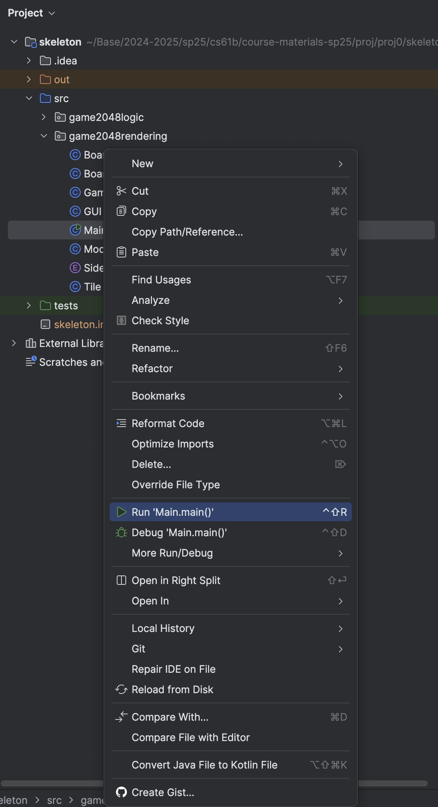
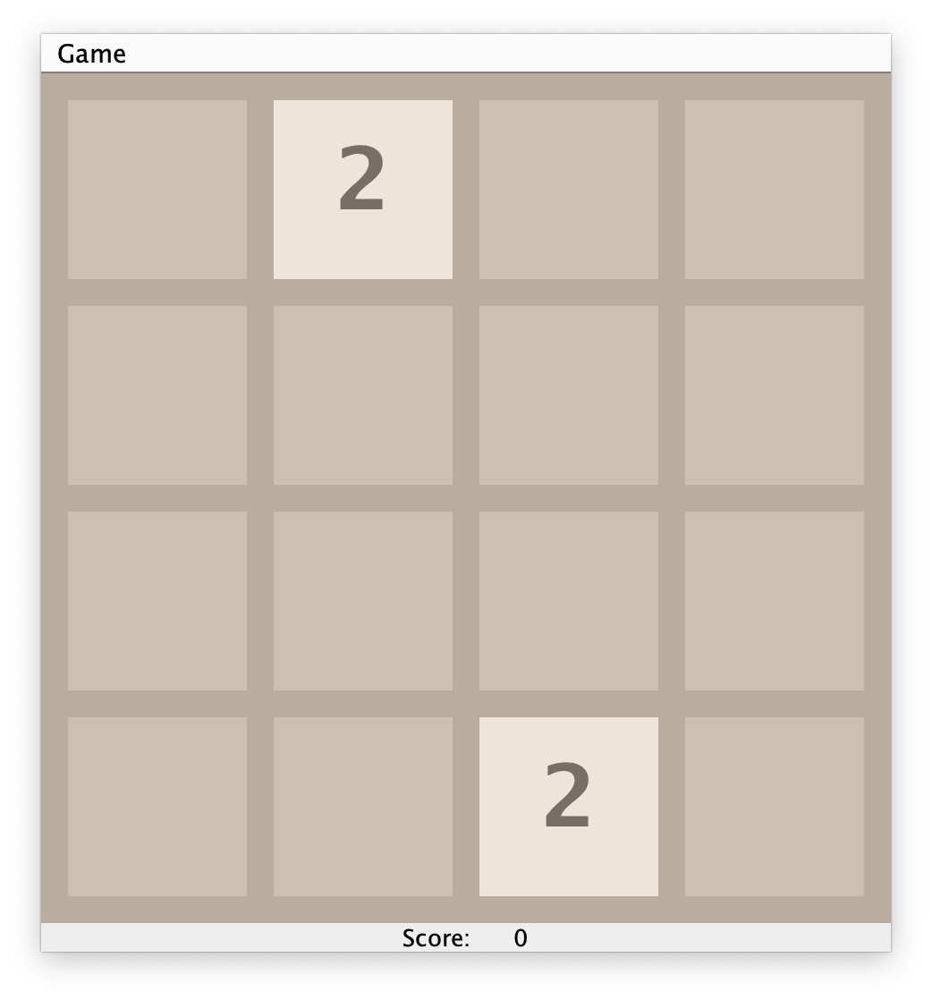

**Deadline: Monday, February 3rd, 11:59 PM PT.**

# Hard Mode Project

This is the hardmode version of this project. You will have to come up with your own design rather than following a sequence of suggested design steps (as in the standard version). There is no extra credit for the hard mode version.

## FAQ

Each assignment will have an FAQ linked at the top. You can also access it by adding `/faq` to the end of the URL. The FAQ for Project 0 is located [here](./faq.md).

{: warning}
Note that this project has limited submission tokens. Please see [Submission and Grading](#submission-and-grading) for more details.

## Overview

Prerequisites:

- [Lab 1](../../labs/lab01/index.md) (required for setup)
- [HW0A](../../homeworks/hw0/hw0a/index.md) (recommended, for Java syntax)
- [HW0B](../../homeworks/hw0/hw0b/index.md) (recommended, for Java syntax)
- Lectures 1-2
- [61B Style Guide](../../resources/guides/style/index.md) (we are checking your style in autograder!)
- [Lab 2](../../labs/lab02/index.md) (optional but recommended prerequisite - helpful for debugging)

<!-- [See here for a video overview of the project.](TODO)  -->

<!-- Any future resources (e.g. project party or intro section recording) can also be linked at the top here for ease of access. -->

In this mini-project, you'll get some practice with Java by creating a playable game of 2048. We've already implemented the graphics and user interaction code for you, so your job is to implement the logic of the game. Note: This version of the project is much more straightforward than previous offerings of this project. If you find online resources (e.g. videos) from previous semesters of 61B, they do not apply to this version of the project.

If you're not familiar with 2048, [you can try out a demo at this link](http://gabrielecirulli.github.io/2048).

There's a lot of starter code that uses Java syntax that you might not have seen before, but it'll be OK! In the real world, you'll often work with codebases that you don't fully understand. Ideally, the system is designed in a modular way so that someone working on one part of the system doesn't need to know the details of the rest of the system. 

In fact, for this project, we've set everything up so that you don't need to open any of the files except for `GameLogic.java`, though you're welcome to browse.

### Using Git

It is important that you commit work to your repository _at frequent intervals_. Version control is a powerful tool for saving yourself when you mess something up or your dog eats your project, but you must use it regularly if it is to be of any use. Feel free to commit every 15 minutes; Git only saves what has changed, even though it acts as if it takes a snapshot of your entire project.

The command `git status` will tell you what files you have modified, removed, or possibly added since the last commit.
It will also tell you how much you have not yet sent to your GitHub repository.

The typical commands would look something like this:

```bash
git status                          # To see what needs to be added or committed.
git add <file or folder path>       # To add, or stage, any modified files.
git commit -m "Commit message"      # To commit changes. Use a descriptive message.
git push origin main                # Reflect your local changes on GitHub so Gradescope can see them.
```

Then you can carry on working on the project until you're ready to commit and push again, in which case you'll repeat the above. It is in your best interest to get into the habit of committing frequently with informative commit messages so that in the case that you need to revert back to an old version of code, it is not only possible, but easy. We suggest you commit every time you add a significant portion of code or reach some milestone (passing a new test, for example).

### 2048 Rules: Basic Rules

2048 is played on a grid of squares. Each square can either be empty or contain a numbered tile.

The player chooses a direction (using the arrow keys) to _tilt_ the board: north, south, east, or west. All tiles slide in that direction until there is no empty space left in the direction of motion. As a tile slides, it can possibly _merge_ with another tile with the same number. You'll implement this in Tasks 2-7.

Each time two tiles merge to form a larger tile, the player earns the number of points on the new tile. We've implemented the score tracking already.

One tile (with value 2 or 4) is randomly generated when the game begins. After each tilt, a single randomly generated tile will be added to the board on an empty square. Note that if the tilt did not change the board state, then no new tiles will be randomly generated. Your code will not be adding any new tiles! We've already done this part for you.

The game ends when the current player has no available moves (no tilt can change the board), or a move forms a square containing 2048. 

If you would like to try the game out yourself, feel free to try it [here](https://play2048.co/).
<!-- I'm not sure if we should link a specific one or not-->

## Setup

### Getting the Skeleton Files

Follow the instructions in the [Assignment Workflow Guide](../../resources/guides/assignment-workflow/index.md) to get the skeleton code and open it in IntelliJ. For this hard mode version of project 0, we will be working in the `proj0_hardmode/` directory.

{: .danger}
> If you get some sort of error, STOP and either figure it out by carefully reading the [git WTFs](../../resources/guides/git/wtfs.md) or seek help at OH or Ed. You’ll save yourself a lot of trouble vs. guess-and-check with git commands. If you find yourself trying to use commands recommended by Google like force push, [don’t](https://twitter.com/heathercmiller/status/526770571728531456). **Don’t use `git push -f`, even if a post you found on Stack Overflow says to do it!**
>
> If you can't get Git to work, watch [this video](https://www.youtube.com/watch?v=Squ8TmG5mX0) as a last resort to submit your work.

### File Structure

The `proj0_hardmode` folder is separated into two _packages_, `game2048logic` and `game2048rendering`. Though we won't talk about them too much in 61B, packages are a way to organize code into different folders. For example, all the code for the graphics is in the `game2048rendering` package, and all the code for the game logic is in the `game2048logic` package. You can see this in the file structure below:

```text
proj0_hardmode
├── game2048logic
|   ├── GameLogic.java
|   ├── MatrixUtils.java
├── game2048rendering
    ├── Board.java
    ... (some other files) ...
    ├── Main.java
    ├── Side.java
    ├── Tile.java
```

{: .info}
> For the entirety of this project, you will only need to read and modify the `game2048logic/GameLogic.java` file. Changes to other files will not be recognized by Gradescope.
>
> There's no need to read any of the code in `game2048rendering`, though you're welcome to if you'd like.

### Running the Game

You can run your game by running the `Main.java` file in the `game2048rendering` package. You can do this by right-clicking the file and selecting "Run 'Main.main()'":

{:style="display:block; margin-left:auto; margin-right:auto"} 

If everything is set up properly, you should get something like the following image: 

{:style="display:block; margin-left:auto; margin-right:auto"} 

Right now, your game won't do anything when you press the arrow keys, but by the end of this project, you'll have a fully functioning 2048 implementation!

## Task 1: Understanding Tilts

In this project, you'll implement the logic that tilts the board. 

### Rules: Tilting

{:style="display:block; margin-left:auto; margin-right:auto"}

The animation above shows a few tilt operations. Here are the full rules for when merges occur that are shown in the image above.

1. Two tiles of the same value _merge_ into one tile containing double the initial number.

2. A tile that is the result of a merge will not merge again on that tilt. For example, if we have [X, 2, 2, 4], where X represents an empty space, and we move the tiles to the left, we should end up with [4, 4, X, X], not [8, X, X, X]. This is because the leftmost 4 was already part of a merge so it should not merge again.

3. When three adjacent tiles in the direction of motion have the same number, then the leading two tiles in the direction of motion merge, and the trailing tile does not. For example, if we have [X, 2, 2, 2] and move tiles left, we should end up with [4, 2, X, X] not [2, 4, X, X].

As a corollary of these rules, if there are four adjacent tiles with the same number in the direction of motion, they
form two merged tiles. For example, if we have [4, 4, 4, 4], then if we move to the left, we end up with [8, 8, X, X]. This is because the leading two tiles will be merged as a result of rule 3, then the trailing two tiles will be merged, but because of rule 2 these merged tiles (8 in our example) will not merge themselves on that tilt.

You'll find applications of each of the 3 rules listed above in the animated GIF above, so watch through it a few times to get a
good understanding of these rules.

### Tilting Rules Quiz

Your task: complete this optional [Google Form quiz](https://forms.gle/xW74vQnK7dZAjS6eA) to check your understanding of the tilting rules.

This quiz (and this task) is not part of your 61B course grade. <!--TODO: but you need to complete it in order to request help from staff on Ed or in office hours. (maybe?) -->

## Task 2: Implementing Tilt

Now that you understand the rules, it's time to write the code that implements them. Open `GameLogic.java` and fill in the `void tilt(int[][] board, Side side)` method. Implementing `tilt` is surprisingly challenging. We have to account for four different possible directions, three different merging rules, etc.

Computer science is essentially about one thing: managing complexity. In order to implement this complicated functionality, we need to break the problem into smaller pieces and tackle them one at a time.

This hard mode version of the project will give you a chance to try to deconstruct the problem into smaller pieces. If you get stuck, feel free to consult the standard mode version of the project.

Tip: Avoid repetitive code. If you find yourself writing long blocks of code that are similar except invoilve different directions, you're doing someting wrong,

### Testing and Debugging

To test your method, run the tests in `TestGameLogic.java`. If your implementation is correct, all tests should pass.

Note that each test in `TestGameLogic.java` provides a large number of example input/output pairs, which can be helpful for debugging or design planning. For example, the code below shows what happens if you tilt towards `Side.NORTH` with the given board.

```java
public void testUpAdjacentNoMerge() {
    int[][] board = new int[][]{
            {0, 0, 0, 0},
            {0, 0, 4, 0},
            {0, 0, 2, 0},
            {0, 0, 0, 0},
    };

    GameLogic.tilt(board, Side.NORTH);

    int[][] expected = new int[][]{
            {0, 0, 4, 0},
            {0, 0, 2, 0},
            {0, 0, 0, 0},
            {0, 0, 0, 0},
    };
```

## Playing the Game

Now that you've implemented the logic for the game, you can play the game by running `Main.java`! 

Note: If you haven't passed all of the tests, the game may behave strangely or crash.

## Style

Starting with this project, **we will be enforcing style**. You must follow the [style guide](../../resources/guides/style/index.md), or you will be penalized on the autograder.

You can and should check your style locally with the CS 61B plugin. **We will not remove the velocity limit for failing to check style.**

## Submission and Grading

{: .danger}
We will **not remove the velocity limit** for failing to submit the correct files because you didn't add, commit, or push. You have been warned.

### Velocity Limiting

For this project we will be limiting the number of times you can submit your code to the autograder. You will get 4 submission "tokens" that each regenerate after 24 hours.

### Grading Overview

Your code will be graded based on whether it passes the tests we provided. There are no hidden tests; the score you see on Gradescope is your score for this project.

Gradescope will only grade your `GameLogic.java` file. If you edit any other files, your edits will not be recognized, so don't edit any other files.

Once you've pushed your code to GitHub (i.e. you've run `git push`), then you may go to Gradescope, find the `proj0` assignment, and submit the code there. Keep in mind that the version of code that Gradescope uses is the most recent commit you've pushed, so if you do not run `git push` before you submit on Gradescope, old code will be tested instead of the most recent code you have on your computer.

There are no hidden tests. The score you see on Gradescope is your score for this project.
