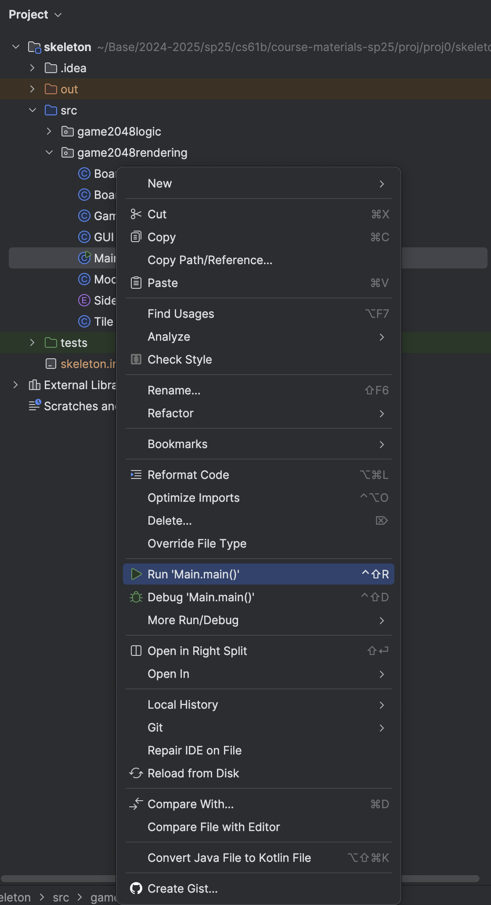

**Deadline: Monday, February 3rd, 11:59 PM PT.**

# Hard Mode Project

If you are a strong programmer, you might be interested in the [hard mode version of this project](hardmode). In the hard mode version, you'll solve the same problem as the standard version of this project, but there will be no handholding and you'll have to come up with the design yourself.

There is no extra credit for completing the hard mode version instead of the standard version.

## FAQ

Each assignment will have an FAQ linked at the top. You can also access it by adding `/faq` to the end of the URL. The FAQ for Project 0 is located [here](./faq.md).

{: warning}
Note that this project has limited submission tokens. Please see [Submission and Grading](#submission-and-grading) for more details.

## Overview

Prerequisites:

- [Lab 1](../../labs/lab01/index.md) (required for setup)
- [HW0A](../../homeworks/hw0/hw0a/index.md) (recommended, for Java syntax)
- [HW0B](../../homeworks/hw0/hw0b/index.md) (recommended, for Java syntax)
- Lectures 1-2
- [61B Style Guide](../../resources/guides/style/index.md) (we are checking your style in autograder!)
- [Lab 2](../../labs/lab02/index.md) (optional but recommended prerequisite - helpful for debugging)

<!-- [See here for a video overview of the project.](TODO)  -->

<!-- Any future resources (e.g. project party or intro section recording) can also be linked at the top here for ease of access. -->

In this mini-project, you'll get some practice with Java by creating a playable game of 2048. We've already implemented the graphics and user interaction code for you, so your job is to implement the logic of the game. Note: This version of the project is much more straightforward than previous offerings of this project. If you find online resources (e.g. videos) from previous semesters of 61B, they do not apply to this version of the project.

If you're not familiar with 2048, [you can try out a demo at this link](http://gabrielecirulli.github.io/2048).

There's a lot of starter code that uses Java syntax that you might not have seen before, but it'll be OK! In the real world, you'll often work with codebases that you don't fully understand. Ideally, the system is designed in a modular way so that someone working on one part of the system doesn't need to know the details of the rest of the system. 

In fact, for this project, we've set everything up so that you don't need to open any of the files except for `GameLogic.java`, though you're welcome to browse.

### Using Git

It is important that you commit work to your repository _at frequent intervals_. Version control is a powerful tool for saving yourself when you mess something up or your dog eats your project, but you must use it regularly if it is to be of any use. Feel free to commit every 15 minutes; Git only saves what has changed, even though it acts as if it takes a snapshot of your entire project.

The command `git status` will tell you what files you have modified, removed, or possibly added since the last commit.
It will also tell you how much you have not yet sent to your GitHub repository.

The typical commands would look something like this:

```bash
git status                          # To see what needs to be added or committed.
git add <file or folder path>       # To add, or stage, any modified files.
git commit -m "Commit message"      # To commit changes. Use a descriptive message.
git push origin main                # Reflect your local changes on GitHub so Gradescope can see them.
```

Then you can carry on working on the project until you're ready to commit and push again, in which case you'll repeat the above. It is in your best interest to get into the habit of committing frequently with informative commit messages so that in the case that you need to revert back to an old version of code, it is not only possible, but easy. We suggest you commit every time you add a significant portion of code or reach some milestone (passing a new test, for example).

### 2048 Rules: Basic Rules

2048 is played on a grid of squares. Each square can either be empty or contain a numbered tile.

The player chooses a direction (using the arrow keys) to _tilt_ the board: north, south, east, or west. All tiles slide in that direction until there is no empty space left in the direction of motion. As a tile slides, it can possibly _merge_ with another tile with the same number. You'll implement this in Tasks 2-7.

Each time two tiles merge to form a larger tile, the player earns the number of points on the new tile. We've implemented the score tracking already.

One tile (with value 2 or 4) is randomly generated when the game begins. After each tilt, a single randomly generated tile will be added to the board on an empty square. Note that if the tilt did not change the board state, then no new tiles will be randomly generated. Your code will not be adding any new tiles! We've already done this part for you.

The game ends when the current player has no available moves (no tilt can change the board), or a move forms a square containing 2048. 

If you would like to try the game out yourself, feel free to try it [here](https://play2048.co/).
<!-- I'm not sure if we should link a specific one or not-->

## Setup

### Getting the Skeleton Files

Follow the instructions in the [Assignment Workflow Guide](../../resources/guides/assignment-workflow/index.md) to get the skeleton code and open it in IntelliJ. For this project, we will be working in the `proj0/` directory.

{: .danger}
> If you get some sort of error, STOP and either figure it out by carefully reading the [git WTFs](../../resources/guides/git/wtfs.md) or seek help at OH or Ed. You’ll save yourself a lot of trouble vs. guess-and-check with git commands. If you find yourself trying to use commands recommended by Google like force push, [don’t](https://twitter.com/heathercmiller/status/526770571728531456). **Don’t use `git push -f`, even if a post you found on Stack Overflow says to do it!**
>
> If you can't get Git to work, watch [this video](https://www.youtube.com/watch?v=Squ8TmG5mX0) as a last resort to submit your work.

### File Structure

The `proj0` folder is separated into two _packages_, `game2048logic` and `game2048rendering`. Though we won't talk about them too much in 61B, packages are a way to organize code into different folders. For example, all the code for the graphics is in the `game2048rendering` package, and all the code for the game logic is in the `game2048logic` package. You can see this in the file structure below:

```text
proj0
├── game2048logic
|   ├── GameLogic.java
|   ├── MatrixUtils.java
├── game2048rendering
    ├── Board.java
    ... (some other files) ...
    ├── Main.java
    ├── Side.java
    ├── Tile.java
```

{: .info}
> For the entirety of this project, you will only need to read and modify the `game2048logic/GameLogic.java` file. Changes to other files will not be recognized by Gradescope.
>
> There's no need to read any of the code in `game2048rendering`, though you're welcome to if you'd like.

### Running the Game

You can run your game by running the `Main.java` file in the `game2048rendering` package. You can do this by right-clicking the file and selecting "Run 'Main.main()'":

{:style="display:block; margin-left:auto; margin-right:auto"} 

If everything is set up properly, you should get something like the following image: 

{:style="display:block; margin-left:auto; margin-right:auto"} 

Right now, your game won't do anything when you press the arrow keys, but by the end of this project, you'll have a fully functioning 2048 implementation!

## Task 1: Understanding Tilts

In this project, you'll implement the logic that tilts the board. 

### Rules: Tilting

{:style="display:block; margin-left:auto; margin-right:auto"}

The animation above shows a few tilt operations. Here are the full rules for when merges occur that are shown in the image above.

1. Two tiles of the same value _merge_ into one tile containing double the initial number.

2. A tile that is the result of a merge will not merge again on that tilt. For example, if we have [X, 2, 2, 4], where X represents an empty space, and we move the tiles to the left, we should end up with [4, 4, X, X], not [8, X, X, X]. This is because the leftmost 4 was already part of a merge so it should not merge again.

3. When three adjacent tiles in the direction of motion have the same number, then the leading two tiles in the direction of motion merge, and the trailing tile does not. For example, if we have [X, 2, 2, 2] and move tiles left, we should end up with [4, 2, X, X] not [2, 4, X, X].

As a corollary of these rules, if there are four adjacent tiles with the same number in the direction of motion, they
form two merged tiles. For example, if we have [4, 4, 4, 4], then if we move to the left, we end up with [8, 8, X, X]. This is because the leading two tiles will be merged as a result of rule 3, then the trailing two tiles will be merged, but because of rule 2 these merged tiles (8 in our example) will not merge themselves on that tilt.

You'll find applications of each of the 3 rules listed above in the animated GIF above, so watch through it a few times to get a
good understanding of these rules.

### Tilting Rules Quiz

Your task: complete this optional [Google Form quiz](https://forms.gle/xW74vQnK7dZAjS6eA) to check your understanding of the tilting rules.

This quiz (and this task) is not part of your 61B course grade. <!--TODO: but you need to complete it in order to request help from staff on Ed or in office hours. (maybe?) -->

### Implementing Tilts

Implementing tilts is surprisingly challenging. We have to account for four different possible directions, three different merging rules, etc.

Computer science is essentially about one thing: managing complexity. In order to implement this complicated functionality, we need to break the problem into smaller pieces and tackle them one at a time.

In future assignments, it'll be your job to figure out how to break problems into smaller pieces. For this project, here's an outline of how we've decided to tackle the tilt problem: <!-- TODO: MAYBE, create a hard mode version of this problem -->

- **Four directions:** Instead of worrying about tilting in all four directions at once, let's start with just the up direction. Later, in the final task (task 6), we'll show you a clever trick to generalize your code and deal with the other three directions with just a few extra lines of code.

- **Key observation:** When you tilt the board up, each of the four columns can be processed independently. The tiles in one column have no effect on the tiles in a different column. Inspired by this observation, we'll write a _helper method_ for tilting one column. Then, to tilt the entire board up (task 5), we'll call that helper method to tilt each of the columns, one by one.

- **Another key observation:** When you tilt a column up, we need to compute the final landing squares for each tile in that column. We could do this all in a single method, but that's going to get complicated quickly. Instead, let's write another _helper method_ for moving a single tile. Then, to tilt the entire column (Task 4), we'll call that helper method to move each tile, one by one.

- **Merging rules:** Before we even deal with merging, let's try to implement tiles tilting up. Then, once the tiles are properly tilting up, we can add logic to implement merging (Task 3).

## Task 2: Move Tile Up (No Merging)

In `GameLogic.java`, fill in the `moveTileUpAsFarAsPossible(int[][] board, int r, int c, int minR)` method. Don't modify any other files or functions in that file.

This method should move the tile at position `(r, c)` as far up in its column as possible. For this task, you should ignore the `minR` parameter completely.

Remember that a tile can move up through empty squares, until the tile either reaches the top row, or the tile reaches an empty square with another tile directly above it.

For this task, don't worry about merges yet. We'll add logic for merging in the next task. 

Below are four **before-and-after** board pairs that illustrate how the `moveTileUpAsFarAsPossible(int[][] board, int r, int c, int minR)` function should behave. For each example, the first table is the **board before** the method call, and the second table is the **board after** the method call. The values of `r` and `c` are explicitly stated for clarity. Remember that, for this task, **merging is ignored** and **`minR` should also be ignored**.

---

### Example 1
**Method call**: `moveTileUpAsFarAsPossible(board, r=3, c=0, minR=0)`

**Before**:

|---|---|---|---|
| 0 | 0 | 0 | 0 |
| 0 | 0 | 0 | 0 |
| 0 | 0 | 0 | 0 |
| 2 | 0 | 0 | 0 |

**After**:

|---|---|---|---|
| 2 | 0 | 0 | 0 |
| 0 | 0 | 0 | 0 |
| 0 | 0 | 0 | 0 |
| 0 | 0 | 0 | 0 |

The tile at `(3, 0)` moves straight up to the top row `(0, 0)`.

---

### Example 2
**Method call**: `moveTileUpAsFarAsPossible(board, r=2, c=1, minR=0)`

**Before**:

|---|---|---|---|
| 0 | 4 | 0 | 0 |
| 0 | 0 | 0 | 0 |
| 0 | 2 | 0 | 0 |
| 0 | 0 | 0 | 0 |

**After**:

|---|---|---|---|
| 0 | 4 | 0 | 0 |
| 0 | 2 | 0 | 0 |
| 0 | 0 | 0 | 0 |
| 0 | 0 | 0 | 0 |

The tile at `(2, 1)` moves up until it is just below the `4`, i.e. it lands at `(1, 1)`.

---

### Example 3
**Method call**: `moveTileUpAsFarAsPossible(board, r=0, c=2, minR=0)`

**Before**:

|---|---|---|---|
| 0 | 0 | 4 | 0 |
| 0 | 0 | 0 | 0 |
| 0 | 0 | 0 | 0 |
| 0 | 0 | 0 | 0 |

**After**:

|---|---|---|---|
| 0 | 0 | 4 | 0 |
| 0 | 0 | 0 | 0 |
| 0 | 0 | 0 | 0 |
| 0 | 0 | 0 | 0 |

The tile at `(0, 2)` is already at the top row, so it does not move.

### Testing and Debugging

To test your method, run the tests in `TestTask2.java` by right-clicking the file and selecting "Run 'TestTask2'". 


{:style="display:block; margin-left:auto; margin-right:auto"}

(You can also run all the tests in the entire folder by right-clicking `tester2048` > "Run 'Tests in 'tester2048''".)

Alternatively, you may open the `TestTask2.java` file and click the green arrow next to `public class TestTask2` to run the tests. An example animation from a previous semester is given below. The files are a bit different, but the process is the same:

<!-- potential todo: update image animations -->
{:style="display:block; margin-left:auto; margin-right:auto"}

You may also run individual tests in the same manner.

You will run all tests in the same way for the rest of the project (and course!).

Running the provided tests will test the three examples above. If your implementation is correct, all tests should pass.

Here is what the error message would look like if you failed one of the tests:

{:style="display:block; margin-left:auto; margin-right:auto"}

On the left-hand side, you'll see the list of all tests that were run. The red exclamation mark means the program errored,
the yellow X means we failed a test (program ran but gave the wrong output), and the
green check means we passed it. On the right, you'll see some useful error messages. To look at a single test and its
error message in isolation, click the test on the left-hand side. For example, let's say we want to look at
the `two tiles, different values` test.


{:style="display:block; margin-left:auto; margin-right:auto"}

The right-hand side is now the isolated error message for this test. The top line has a useful
message: `Boards should match` followed by a `String` representation of the expected (what should happen) and actual (what your code generated) boards. 
You'll see that the 2 stayed in its position even though it was supposed to move up to the position below the 4, which is causing this test to fail. The javadoc comment at the
top of the code for the test also has some useful information in case you're failing a test. You can click on the text underlined in blue to see the contents of the test.

One common error that you might encounter is an `ArrayIndexOutOfBoundsException`. Here is what an `ArrayIndexOutOfBoundsException` error message might look like:

{:style="display:block; margin-left:auto; margin-right:auto"}

`ArrayIndexOutOfBoundsException`s occur when we attempt to access a value at an illegal index. For example, the array `arr = [4, 2, 2, 4]` has legal indexes 0, 1, 2, and 3. Attempting to access `arr[4]` or `arr[-1]` would throw an `ArrayIndexOutOfBoundsException`.

We can evaluate where an `ArrayIndexOutOfBoundsException` is happening in our code by examining the stack trace provided in the test output. Taking a closer look at the previous example:

{:style="display:block; margin-left:auto; margin-right:auto"}

The stack trace shows us which lines of code were executed leading up to the error, with the top line being the most recent. The line `at game2048logic.GameLogic.moveTileUpAsFarAsPossible(GameLogic.java:30)` tells us a few things about our error. First, we can see that our `ArrayIndexOutOfBoundsException` was triggered in the `game2048logic.GameLogic` class, within the `moveTileUpAsFarAsPossible` method. `GameLogic.java:30` specifies that line 30 triggered the error. This was called by line 33 in the `testOneTile` method in the `TestTask2` class, and so on.

The stack trace is a useful starting place for debugging. You can click on the blue underlined section of the stack trace to jump directly to that line of code. 

## Task 3: Merging Tiles

Modify the `moveTileUpAsFarAsPossible` method so that it accounts for the possibility of the tile merging.

Remember that a tile can move up through empty squares. When the tile sees a non-empty square, if that square contains another tile of the same value, then the two tiles should merge.

If there is a merge, `moveTileUpAsFarAsPossible` should return 1 + the row number where the merge occurred. If there is no merge, it should return 0. This might seem quite arbitrary. We'll see why this is useful in task 4.

As in task 2, you should ignore the `minR` argument.

**Method call**: `moveTileUpAsFarAsPossible(board, r=3, c=0, minR=0)`

**Before**:

|---|---|---|---|
| 2 | 0 | 0 | 0 |
| 0 | 0 | 0 | 0 |
| 0 | 0 | 0 | 0 |
| 2 | 0 | 0 | 0 |

**After**:

|---|---|---|---|
| 4 | 0 | 0 | 0 |
| 0 | 0 | 0 | 0 |
| 0 | 0 | 0 | 0 |
| 0 | 0 | 0 | 0 |

Tiles of the same value (2 and 2) merge into 4 at the top of the column. The method should return 1 because a merge occurred in row 0.

---

**Method call**: `moveTileUpAsFarAsPossible(board, r=2, c=0, minR=0)`

**Before**:

|---|---|---|---|
| 8 | 0 | 0 | 0 |
| 4 | 0 | 0 | 0 |
| 8 | 0 | 0 | 0 |
| 0 | 0 | 0 | 0 |

**After**:

|---|---|---|---|
| 8 | 0 | 0 | 0 |
| 4 | 0 | 0 | 0 |
| 8 | 0 | 0 | 0 |
| 0 | 0 | 0 | 0 |

The `8` at `(2, 0)` cannot merge with `(0, 0)` because there is a `4` in between. The method should return 0 because there was no merge.

---

**Method call**: `moveTileUpAsFarAsPossible(board, r=3, c=2, minR=0)`

**Before**:

|---|---|---|---|
| 0 | 0 | 2 | 0 |
| 0 | 0 | 2 | 0 |
| 0 | 0 | 2 | 0 |
| 0 | 0 | 2 | 0 |

**After**:

|---|---|---|---|
| 0 | 0 | 2 | 0 |
| 0 | 0 | 2 | 0 |
| 0 | 0 | 4 | 0 |
| 0 | 0 | 0 | 0 |

The bottom tile `(3, 2)` merges with `(2, 2)`, forming 4. It cannot merge again in this single move. The method should return 3 because the merge occurred in row 2.

---

**Method call**: `moveTileUpAsFarAsPossible(board, r=2, c=2, minR=0)`

**Before**:

|---|---|---|---|
| 0 | 0 | 2 | 0 |
| 0 | 0 | 2 | 0 |
| 0 | 0 | 2 | 0 |
| 0 | 0 | 4 | 0 |

**After**:

|---|---|---|---|
| 0 | 0 | 2 | 0 |
| 0 | 0 | 4 | 0 |
| 0 | 0 | 0 | 0 |
| 0 | 0 | 4 | 0 |

The tile at `(2, 2)` merges with `(1, 2)` to form a `4`. The tile in `(3, 2)` remains a `4` at the bottom until it might move later. The method should return 2 because the merge occurred in row 1.

### Testing and Debugging

To test your method, run the tests in `TestTask3.java`, which tests on the examples above. If your implementation is correct, all tests should pass.


## Task 4: Merging Tiles up to MinR

In `GameLogic.java`,modify your `moveTileUpAsFarAsPossible(int[][] board, int r, int c, int minR)` method so that the tile is not allowed to move any higher than the row given by `minR`.

Note: It should not be clear why `minR` is going to be helpful later. You'll see why it's useful in task 5!

#### Example 1
**Method call**: `moveTileUpAsFarAsPossible(board, r=3, c=0, minR=0)`

**Before**:

|---|---|---|---|
| 2 | 0 | 0 | 0 |
| 0 | 0 | 0 | 0 |
| 0 | 0 | 0 | 0 |
| 2 | 0 | 0 | 0 |

**After**:

|---|---|---|---|
| 4 | 0 | 0 | 0 |
| 0 | 0 | 0 | 0 |
| 0 | 0 | 0 | 0 |
| 0 | 0 | 0 | 0 |

**Explanation**: The bottom tile `(3,0)` moves up to `(0,0)` and merges with `2` to become `4`. Since a merge occurred, the return value is `1`.

---

#### Example 2
**Method call**: `moveTileUpAsFarAsPossible(board, r=3, c=0, minR=1)`

**Before**:

|---|---|---|---|
| 2 | 0 | 0 | 0 |
| 0 | 0 | 0 | 0 |
| 0 | 0 | 0 | 0 |
| 2 | 0 | 0 | 0 |

**After**:

|---|---|---|---|
| 2 | 0 | 0 | 0 |
| 2 | 0 | 0 | 0 |
| 0 | 0 | 0 | 0 |
| 0 | 0 | 0 | 0 |

**Explanation**: With `minR = 1`, the tile at `(3,0)` can move only up to `(1,0)` and does not merge with the tile at `(0,0)`. Since no merge occurred, the method returns `0`.

---

#### Example 3
**Method call**: `moveTileUpAsFarAsPossible(board, r=3, c=0, minR=3)`

**Before**:

|---|---|---|---|
| 2 | 0 | 0 | 0 |
| 0 | 0 | 0 | 0 |
| 0 | 0 | 0 | 0 |
| 2 | 0 | 0 | 0 |

**After**:

|---|---|---|---|
| 2 | 0 | 0 | 0 |
| 0 | 0 | 0 | 0 |
| 0 | 0 | 0 | 0 |
| 2 | 0 | 0 | 0 |

**Explanation**: With `minR = 3`, the tile at `(3,0)` is not allowed to move up at all, so the board remains unchanged, and no merge occurs. The method should return `0`.

### Testing and Debugging

To test your method, run the tests in `TestTask4.java`. If your implementation is correct, all tests should pass. The test file contains more tests than shown above. If you fail these tests, you might want to look at the code for these tests to understand what's going wrong.

## Task 5: Tilt Column

Now that we've fully implemented `moveTileUpAsFarAsPossible`, we can use it to implement `tiltColumn` in `GameLogic.java`. This function will tilt an entirely column upwards. 

This method should tilt the given column at coordinate `x` up, moving all of the tiles in that column into their rightful place, and merging any tiles in that column that need to be merged.

Remember to use your `moveTileUpAsFarAsPossible` helper method to keep things simple! Consider: What tiles should you call this helper method on, and in what order? How should you use the return value of `moveTileUpAsFarAsPossible` to avoid double merges?

Note: The clever design of `moveTileUpAsFarAsPossible` will make the code for this task relatively short and simple. My implementation of `tiltColumn` is only 8 lines long including brackets and definition. You'll find throughout the course that it is far easier to implement a system if you have a clean design, e.g. helper methods like `moveTileUpAsFarAsPossible`, which was designed to naturally avoid double merges.

#### Example 1: No merge
**Method call**: `tiltColumn(board, 0)`

**Before**:

|---|---|---|---|
| 0 | 0 | 0 | 0 |
| 0 | 0 | 0 | 0 |
| 4 | 0 | 0 | 0 |
| 2 | 0 | 0 | 0 |

**After**:

|---|---|---|---|
| 4 | 0 | 0 | 0 |
| 2 | 0 | 0 | 0 |
| 0 | 0 | 0 | 0 |
| 0 | 0 | 0 | 0 |

**Explanation**: The tiles `4` and `2` simply move up in column `0` without merging.

---

#### Example 2: One merge required

**Method call**: `tiltColumn(board, 1)`

**Before**:

|---|---|---|---|
| 0 | 0 | 0 | 0 |
| 0 | 0 | 0 | 0 |
| 0 | 4 | 0 | 0 |
| 4 | 4 | 4 | 4 |

**After**:

|---|---|---|---|
| 0 | 8 | 0 | 0 |
| 0 | 0 | 0 | 0 |
| 0 | 0 | 0 | 0 |
| 4 | 0 | 4 | 4 |

**Explanation**: Only column `1` is processed. The `4` at `(2,1)` and `4` at `(3,1)` merge into `8` at `(0,1)`. The rest of row 3 remains unchanged for columns `2` and `3`.

---

#### Example 3: Same tiles separated, no merge through intervening tiles
**Method call**: `tiltColumn(board, 3)`

**Before**:

|   |   |   |   |
|---|---|---|---|
| 4 | 0 | 0 | 4 |
| 0 | 0 | 0 | 0 |
| 8 | 0 | 0 | 8 |
| 4 | 0 | 0 | 4 |

**After**:

|   |   |   |   |
|---|---|---|---|
| 4 | 0 | 0 | 4 |
| 0 | 0 | 0 | 8 |
| 8 | 0 | 0 | 4 |
| 4 | 0 | 0 | 0 |

**Explanation**: Only column `3` tilts upward. The tiles stack as far up as possible, but `4` at `(0,3)` doesn't merge with `8` at `(2,3)`. Similarly, the two `4`s at `(2,3)` and `(3,3)` don’t merge because one is actually `8`.

---

#### Example 4: No merge with merged tiles
**Method call**: `tiltColumn(board, 2)`

**Before**:

|   |   |   |   |
|---|---|---|---|
| 0 | 0 | 2 | 0 |
| 0 | 0 | 2 | 0 |
| 0 | 0 | 4 | 0 |
| 0 | 0 | 0 | 0 |

**After**:

|   |   |   |   |
|---|---|---|---|
| 0 | 0 | 4 | 0 |
| 0 | 0 | 4 | 0 |
| 0 | 0 | 0 | 0 |
| 0 | 0 | 0 | 0 |

**Explanation**: Column `2` tilts upward. The `2` at `(0,2)` and `2` at `(1,2)` merge to become `4` at `(0,2)`. However, the resulting `4` does not merge with the existing `4` at `(2,2)` in the same move, so they stack up at rows `0` and `1`.

### Testing and Debugging

To test your method, run the tests in `TestTask5.java`. If your implementation is correct, all tests should pass.

## Task 6: Tilt Up

In `GameLogic.java`, fill in the `tiltUp(int[][] board)` method.

This method should tilt the entire board up, moving all tiles in all columns into their rightful place, and merging any tiles that need to be merged.

### Testing and Debugging

To test your method, run the tests in `TestTask6.java`. If your implementation is correct, all tests should pass. Unlike the earlier tasks, we do not provide any examples in this spec. See the code for `TestTask6.java` for such examples.

## Task 7: Tilt in Four Directions

Now that we've written `tiltUp` working for the up direction, our game should work but only if the user presses up. We need to implement the other three directions.

One possible approach is to create three more functions `moveTileRightAsFarAsPossible`, `moveTileDownAsFarAsPossible`, and `moveTileLeftAsFarAsPossible`, which we can use to ultimately implement `tiltRight`, `tiltDown`, and `tiltLeft`. This is a terrible idea. This leads to messy, hard-to-read code, with ample opportunity to introduce obscure bugs, e.g. what if you fix something in one copy, but not the other three copies?

Instead, we'll take advantage of the provided `rotateLeft` and `rotateRight` methods, which rotate the board.

Fill in the provided `tilt` method so that it handles all four directions properly.

### Testing and Debugging

To test your method, run the tests in `TestTask7.java`. If your implementation is correct, all tests should pass.

Testing files such as `TestIntegration.java` test all the things you write in coordination with each other. Such a test is called an integration test and is incredibly important in testing. While unit tests run things in isolation, integration tests run things all together and are designed to catch obscure bugs that occur as a result of the interaction between different functions you’ve written. Do not attempt to debug `TestIntegration.java` until you’re passing the rest of the tests!

## Playing the Game

Now that you've implemented the logic for the game, you can play the game by running `Main.java`! 

Note: If you haven't passed all of the tests, the game may behave strangely or crash.

## Style

Starting with this project, **we will be enforcing style**. You must follow the [style guide](../../resources/guides/style/index.md), or you will be penalized on the autograder.

You can and should check your style locally with the CS 61B plugin. **We will not remove the velocity limit for failing to check style.**

## Submission and Grading

{: .danger}
We will **not remove the velocity limit** for failing to submit the correct files because you didn't add, commit, or push. You have been warned.

### Velocity Limiting

For this project we will be limiting the number of times you can submit your code to the autograder. You will get 4 submission "tokens" that each regenerate after 24 hours.

### Grading Overview

Your code will be graded based on whether it passes the tests we provided. There are no hidden tests; the score you see on Gradescope is your score for this project.

Gradescope will only grade your `GameLogic.java` file. If you edit any other files, your edits will not be recognized, so don't edit any other files.

Tests are "all or nothing" in their own fields. If you fail one of the subtests in the test category, you will not receive credit for that category although you might have passed different test cases. For example, you'll see in Gradescope `TestModel` category 5 subtests.

Here is a breakdown of the weight of each part:

1. `TestTask2`: 15%
2. `TestTask3`: 20%
3. `TestTask4`: 20%
4. `TestTask5`: 8%
5. `TestTask6`: 4%
6. `TestTask7`: 8%
7. `TestIntegration`: 25%

Once you've pushed your code to GitHub (i.e. you've run `git push`), then you may go to Gradescope, find the `proj0` assignment, and submit the code there. Keep in mind that the version of code that Gradescope uses is the most recent commit you've pushed, so if you do not run `git push` before you submit on Gradescope, old code will be tested instead of the most recent code you have on your computer.

There are no hidden tests. The score you see on Gradescope is your score for this project.
