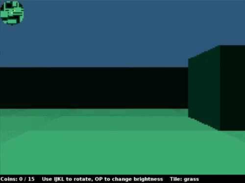

## Deadlines


{{ deadlines | markdownify }}

## Ambition Features

30 points of your project score will be based on features of your choosing, which we call your "ambition score". The big idea is that beyond the base requirements of this project, we want you to try to polish your product a bit more and add some cool features. Below is a list of features worth either 22 points (primary feature) or 8 points (secondary feature).

From these two categories, you need to implement 30 points of features, and at least one of your features must be a primary feature. Here are some ways to achieve this:
- One primary feature and one secondary feature. This is the most common way.
- Two primary features.

This "ambition" category is only worth 30 points. For example, if you implement 38 points of features, you do not get extra credit. However, feel free to add as many features as you'd like if you have the time and inclination.

Your project must still meet the basic requirements described earlier in the spec! For example, if you allow the user to use mouse clicks, the project should still allow keyboard based movement!

Under the description of some primary features, we've provided some GIFS that would score full points on their respective ambition point items to help clear any confusions. Yours do not need to look exactly like the examples given.

You are not restricted to the features we list below! We strongly encourage you to come up with your own. We have an Ed megathread ([Feature Request Ed thread](https://edstem.org/us/courses/74627/discussion/6483454)) where you can run your ideas by us to confirm that it meets our standards.

If you're participating in the LLM pilot project, your features are only worth half credit each, i.e. you might implement e.g. two primary features (11 points each) and two secondary features (4 points each) to reach 30 points.

### Files

For some ambition features, you might customize your world through custom images, audios, and other assets. Make sure to upload these files into your project and organize them accordingly.

In addition, use *relative file paths* instead of absolute file paths. For instance, if you have your music file `menu_music.wav` under a separate package called `music` underneath `src`, you can reference it as `music/menu_music.wav`.

Doing both of these steps will allow anyone who has your project on their laptop to be able to view and use your files.

## Primary Features (22 points)

- **Line of Sight**: Create a system so that the tile renderer only displays tiles on the screen that are within the line of sight of the avatar. The line of sight must be able to be toggled on and off with a keypress.

    

- **Light Sources**: Add the ability for light sources to affect how the world is rendered, with at least one light source that can be turned on and off with a keypress. The intensity of the light must diminish in a gradient as the distance from the source increases. Light sources should fill a majority of the room it belongs to, and light should not pass through walls.

    

- **Pathfinder**: Add entities which chase the avatar/other entities by use of a search algorithm from class, with a toggle to display their projected path. Implementing more than one pathfinding algorithm will NOT count as a second primary feature.

    

- **Encounters**: Create a system for “encounters”, where a new interface appears when the avatar interacts with entities in the world, returning the avatar to the original interface when the encounter ends (e.g. Pokémon). It's okay if save/load is not available during encounters.

    

- **Perspective**: Add the ability for the user to change the perspective of their view (first-person, isometric 2.5D, 3D, etc.) (We've never seen anyone do isometric 2.5D or full 3D before! The Nintendo 64 game '[Kirby 64 - The Crystal Shards](https://www.youtube.com/watch?v=5uu2TWli-_M)' is an example of what an isometric 2.5D world looks like). One particularly interesting example is [Dorottya Urmossy and David Yang's Fall 2022 submission](https://www.youtube.com/watch?v=XJBQYucuAKc&t=94s), which is a 2.5D first-person view, i.e. the world is 3D but the entities are 2D. 

    

- **Battle System**: Implement a battle system that allows players to interact with moving enemies and obstacles. Assign the player a health value, place collectibles that restore health around the map, and create randomly-moving enemies/objects that inflict damage on and receive damage from the player.

- **Explorer**: Make your world larger than the preset display size such that the player can "explore" beyond the starting world. The rendered world should move with the player beyond a certain point and be scrollable.

- **Warp**: Make your world "wrap" around the border of the rendered world, where the player should be able to enter from one side of the screen and exit from the opposite side interchangeably. In order to wrap, you must have rooms on the edge of the world that clip off such that the opposite side also has a room that is clipped off, allowing the player to continue traveling on the floor tiles. The world should still follow the [World Requirements](https://fa24.datastructur.es/projects/proj3/proj3a/#world-requirements) from Part A excluding requirement #10.

- **Online Multiplayer**: Add online multiplayer where other users can join and leave the current game. `java.net.Socket` might be useful here.

- **NPCs**: Add NPC interaction and dialogue with the player. Allow the player to choose different response options depending on the NPC and/or game state. Let us know if you do any cool realtime API calls to an LLM service.

- **Levels**: Implement elevators/navigable floors with a toggleable multi-floor view or with a significantly different interface with the ability to go back to the main world.

- **Altered Terrain**: Implement the ability for the avatar to significantly alter the landscape of the world, e.g. digging, triggering traps that cause parts of the world to become dangerous or impassible, solving puzzles that make some rooms accessible only after fulfilling some objective.

## Secondary Features (8 points)

- **Replay**: Add the ability for the user to "replay" their most recent save, visually displaying all the actions taken since the last time a new world was created. This must result in the same final state as would occur if the user had loaded the most recent save. This means that the game should be playable once the replay is complete.

- **Save Slots**: Add multiple save slots that can be accessed with a new menu option, and a new keyboard shortcut to save to a slot other than slot 1. You should be careful to still support the default behavior of saving and loading in order to be consistent with the replay string requirements.

- **New World**: Add the ability to create a new world without closing and reopening the project, either as a special option you can press while exploring, or when you reach a "game over" state if you've turned your world into a game.

- **Custom Avatar**: Add a menu option to change your avatar's appearance to a custom image created by you (e.g. a non-Tileset image).

- **Theme**: Add a menu option or randomly determine what the environment/theme of the world will be.

- **Landscape**: Add a menu option or randomly determine what the landscape of the world will be (e.g, dungeons, islands, plains, etc.).

- **Language**: Add a menu option to change all text in the interface to a different language. English should be the default and there should be a way to switch it back to English.

- **Mouse Support**: Add support for mouse clicks on the main menu for anything that can be done with a keypress on the main menu. You do not have to implement this for typed user input (e.g. seed generation).

- **Image Renderer**: Make your engine render images instead of unicode characters.

- **Audio**: Add cool music to both your menu and exploration interface, as well as sound effects for interactions the avatar makes with the world.

- **Minimap**: Add a minimap somewhere which shows the entire map and the current avatar location. This feature is a lot more interesting if you also implement a map which is larger than the screen so that you are unable to see the entire map normally.

- **Rotate**: Add ability to rotate the world, i.e. turn the board 90 degrees and adjust movement keys accordingly.

- **Mouse Movement**: Add support for movement with mouse clicks on any visible square. You'll need to implement some sort of algorithm for pathfinding.

- **Local Multiplayer**: Add support for 2 users to interact at the same time. This will require that you have two avatars on screen which can move around, and they should have separate control schemes.

- **Moveable Blocks**: Add ability for the player to place and remove blocks based on a sequence of keypresses.

- **Coins**: Add the ability for the user to collect coins. Once all coins are collected, the user should be returned to the main menu, where they are given the option to either start a new game, load a previous world, or quit.
