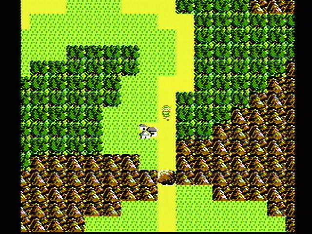

## Deadlines


{{ deadlines | markdownify }}

## Welcome

In Project 3, you will create an engine for generating explorable worlds. This is a large design project that will require you and one partner to work through every stage of development from ideation to presentation. The goal of this project is to teach you how to handle a larger piece of code with little starter code in the hopes of emulating something like a product development cycle. In accordance with this, the grading of this project will be different from other projects. Since there is no notion of "the correct answer" when it comes to world design and implementation, you will be assessed much like a performance review you might receive at an internship or job in addition to a very general autograder. While this means you will be graded slightly subjectively, we promise to be pretty nice bosses and will respect you as any boss should respect their hardworking employees. Please talk to us if you feel the grading scheme feels unfair.

Another goal of this project is to learn how to recognize and mitigate code complexity. Inevitably, whenever a team builds a large software system, they'll make some bad design decisions and they'll engage in corner cutting to get things working.

This results in what is often called "technical debt". Your code becomes complicated to understand and modify, which in the real world translates to software that becomes stale and expensive to maintain. It is *very likely* that your code will feel sort of hacked together by the end of this project. This is a good thing. As you grow as a programmer over the course of your career, arguably the main skill you'll be building is to avoid such hacks, The only way to know and defeat complexity is to suffer from it.

*Don't miss the Software Engineering I lecture*, in which I'll go through John Ousterhout's great book about managing software complexity.

This project will require you a great deal of exploration and experimentation. Searching the web for answers (not solutions from past semesters) should be a regular activity throughout this process. Please know that there are no right and wrong answers, as this is a very open-ended project. However, there are some implementations and ideas that are better than others. It is ok and expected that you will go through several iterations before settling on something that you deem good. That is, this project is about software engineering.

You're not required to use any of the fancy data structures or concepts from class (A*, MSTs, Disjoint Sets, etc.). This project is about software engineering, not about data structures or algorithms. The data structures and algorithms we've learned about in class will make your code significantly simpler and more efficient, but please don't use things just because we learned about them in class. Only use these tools if you feel comfortable using them in your implementation.

[A video playlist (from Spring 2018) discussing tips for working on this project can be found at this link](https://www.youtube.com/playlist?list=PL8FaHk7qbOD6REWjsJd5jz9fpXO5_3ebY&disable_polymer=true) Note: The tour through the skeleton code is a bit out of date, for example, the `playWithKeyboard` and `playWithInputString` methods are gone. 

## Overview

Your task for the next few weeks is to design and implement a 2D tile-based world exploration engine. By "tile-based", we mean the worlds you generate will consist of a 2D grid of tiles. By "world exploration engine" we mean that your software will build a world, which the user will be able to explore by walking around and interacting with objects in that world. Your world will have an overhead perspective. As an example of a much more sophisticated system than you will build, the NES game "Zelda II" is (sometimes) a tile based world exploration engine that happens to be a video game:

The system you build can either use graphical tiles (as shown above), or it can use text based tiles, like the game shown below:

We will provide a tile renderer and a small set of starter tiles for you to use.

Your roadmap for this project:

1. First, you'll implement code to generate random worlds.
2. Then, you'll add a main menu for the user to start the game from.
3. Then, you'll add support for saving a game and loading it back.
4. Finally, you'll get a chance to add any extra fun features to your project.

This is our suggested order for working on the project, but since it's a design project with no starter code, you can work on these features in any order you'd like!

The major goal of this project is to give you a chance to attempt to manage the complexity that comes with building a large system. Be warned: The system you build probably isn't going to be that fun for users! Three weeks is simply not enough time, particularly for novice programmers. However, we do hope you will find it to be a fulfilling project, and the worlds you generate might even be beautiful.

## Large Language Model (LLM) Policy

### Reminder: LLM Usage

Recall that in the collaboration policy, we say:

"Use of GitHub Copilot / GPT3 / etc. is permitted with extreme caution if you're just generating some amount of boilerplate code, that's ok. However, you should not use such tools to generate non-trivial methods. We are trying to build your fundamental skills, and leaning on an AI is going to cause you trouble in circumstances where you don't have an AI to help, such as exams. Any AI generated code must be cited and explicitly commented as such."

This remains true for project 3, unless you want to participate in the pilot program described below.

### Task 8 with LLM Support

Optionally, for **Task 8 (Ambition Features) only**, you may participate in a pilot program where you may use LLMs however you wish to complete this part of the project.

To participate in this pilot program, you'll need to:
 - Fill out the participation form stating your intention to participate.
 - When done with the project, fill out the LLM Task 8 experience report and create an accompanying youtube video (which may be public or unlisted).

If you participate in this pilot program, you'll be able to use an LLMs in any way you choose **for task 8 only**. You may use any LLM of any power, even very powerful paid models like o1-pro.

The most powerful models can easily complete task 8 on their own if you simply give them the spec and your code base. Thus, we're asking that you don't simply outsource task 8 entirely in such a boring way. That is **don't simply paste the ambition points spec into an LLM and have it pick and implement a task for you.** 

Instead, participants in this pilot program should engage in a process of iterative development in tandem with the LLM: Come up with a vision, see what the LLM spits out, learn what you can about the LLMs capabilities based on the generated code, and refine your vision (and prompts, if applicable). 

Keep in mind that LLMs vary widely in quality and power. You should think of them as assistant programmers whom you've hired to help you out on your project — simpler models like ChatGPT 4o are prone to making subtle mistakes. 

Warning: Course staff reserves the right to revoke your participation in this pilot program if you've violated course policies on previous assignments, or on other non-task 8 parts of this project.

**You should assume that staff will not help debug LLM-generated code unless you have a very specific question.** Ask the LLM to help.

**Recommendation: Avoid letting an LLM generate code using Java features that we haven't learned in class, such as lambdas, anonymous classes, and streams.** If you see super weird code, ask the LLM to try again but not using these advanced Java features. 

**Recommendation: Try to understand the code that the LLM generates.** You might learn something interesting!