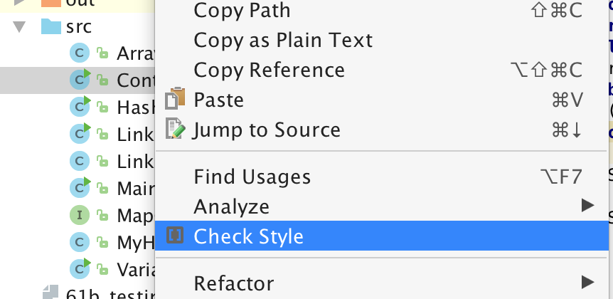
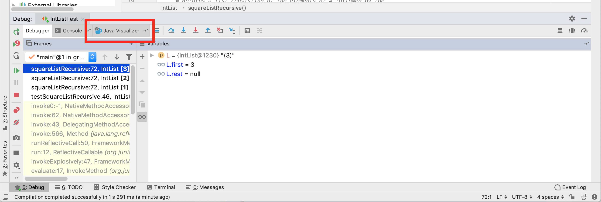
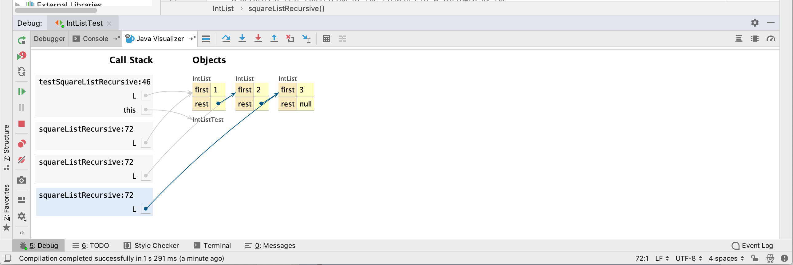

This document will guide you through installing and using the CS 61B IntelliJ
plugins. This guide assumes that you already have IntelliJ installed, as well
as the plugins from Lab 1, and update the plugins to their most recent versions.

## Using the Plugins ##

### Style Checking ###

In this class, you will eventually be required to make sure your code conforms
to the official style guide. The plugin includes a helpful style checker, which
will check your code and inform you of any style errors and their locations.

To run the style checker, simply right click any file or directories you want to
check, and select **Check Style** in the menu that appears:

Click it, and the style checker will run. A tool window will appear with the
results of the style check, and a list of any errors. Click the links to jump
directly to the problematic line of code:

### Java Visualizer ###

The "Java Visualizer" plugin contains a tool similar to
the Python Visualizer you may have used in CS 61A. This tool is intended to help
you debug and understand your code, and is integrated into IntelliJ's Java
debugger.

To use the built-in visualizer, debug your code, setting breakpoints as
necessary. When your code stops, you can click the Java Visualizer tab:

The Java Visualizer will appear, displaying the stack of the currently paused
program:

As you continue to step through and pause your code, the visualizer display will
update accordingly to show you what's going on in your program.
