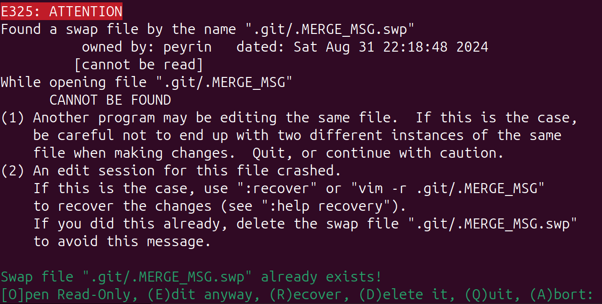
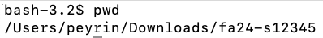
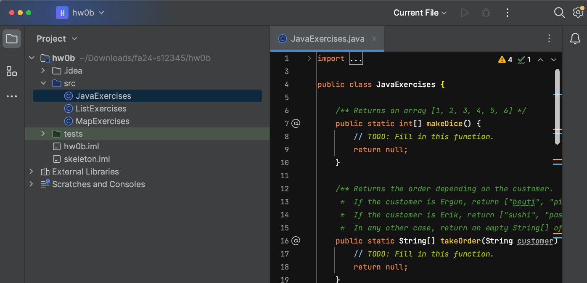
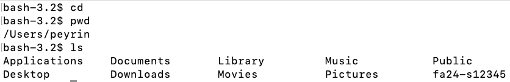

This document is intended to help you through frequently encountered weird
technical failure scenarios (WTFS) in Git. It will be populated as questions
arise.

## fatal: refusing to merge unrelated histories

This usually happens when someone has changed the skeleton code after you've
pulled from it. Pull with `--allow-unrelated-histories`, i.e.

```console
$ git pull skeleton main --allow-unrelated-histories --no-rebase
```

You may need to [resolve some resulting merge conflicts](#what-are-all-these-symbols-in-my-code).

or, if you're pulling from your own `s***` student repo (on a different computer
for example),

```console
$ git pull origin main --allow-unrelated-histories --no-rebase
```


## Error: failed to push some refs??

Sometimes when working with others, you'll get a message like this when you push:

```console
$ git push origin main
To https://github.com/gilbertghang/recipes.git
 ! [rejected]     main -> main (non-fast-forward)
error: failed to push some refs to 'https://github.com/gilbertghang/recipes.git"
hint: Updates were rejected because the tip of your current branch is behind
hint: its remote counterpart. Integrate the remote changes (e.g.
hint: 'git pull ...') before pushing again.
hint: See the 'Note about fast-forwards' in 'git push --help' for details.
```

What has happened here is that your remote (i.e. your online Github repository)
contains commits that your local repository does not have. Luckily, Git is very
good about telling you how to fix these errors: if you read the error message
carefully, you'll see that is suggests that you `git pull`. Do that, fix any
[merge conflicts](#what-are-all-these-symbols-in-my-code), and push. Done!

## What are all these >>>> symbols in my code??

Sometimes when you pull from a repository, you'll get a message like this when you pull:

```console
$ git pull origin main
From github.com:Berkeley-CS61B/course-materials-sp16
 * branch            main     -> FETCH_HEAD
Auto-merging proj/proj0/solution/canonical/Planet.java
CONFLICT (content): Merge conflict in proj/proj0/solution/canonical/Planet.java
Automatic merge failed; fix conflicts and then commit the result.
```

The problem here is that the code on your computer had a conflict with the code
in the remote repository you're pulling from, and Git couldn't figure out how
to resolve it. Since it is unsure, Git refuses to overwrite your local code.

However, when you open your Planet.java, you see some kind of crazy garbage
like:

```java
    public Planet(Planet p) {
<<<<<<< HEAD
        this.xPos = p.xPos;
        this.yPos = p.yPos;
=======
        this.xxPos = p.xxPos;
        this.yyPos = p.yyPos;
>>>>>>> 27ddd0c71515e5cfc7f58a43bcf0e2144c127aed
```

This is a good thing! Everything between `<<<<<<< HEAD` and `=======` is what
was on your computer, and everything between `=======` and
`27ddd0c71515e5cfc7f58a43bcf0e2144c127aed` is what was on the remote server.

Your job is to look for these and resolve the merge conflict yourself. In this
case, the remote repository is right, so we simply delete out everything
between `<<<<<<< HEAD` and `=======`, and also delete the
`>>>>>>> 27ddd0c71515e5cfc7f58a43bcf0e2144c127aed` marker, leaving:

```java
public Planet(Planet p) {
    this.xxPos = p.xxPos;
    this.yyPos = p.yyPos;
```

Once you've resolved all of your merge conflicts, add all the files you
manually edited, and commit them as usual, e.g.

```console
git add Planet.java
git commit -m "resolved merge conflict"
git push origin main
```

## error: You have not concluded your merge (MERGE_HEAD exists).

If you see a message like this:

```
error: You have not concluded your merge (MERGE_HEAD exists).
hint: Please, commit your changes before merging.
fatal: Exiting because of unfinished merge.
```

Add and commit your current changes, and then pull again.

If, after pulling again, your terminal shows a message like "Please enter a commit message to explain why this merge is necessary," see the section directly after this one.


## Please enter a commit message to explain why this merge is necessary

If you see a message like this:

```
Merge branch 'main' of https://github.com/Berkeley-CS61B/skeleton-{{ site.semester }}
# Please enter a commit message to explain why this merge is necessary,
# especially if it merges an updated upstream into a topic branch.
#
# Lines starting with '#' will be ignored, and an empty message aborts
# the commit.
```

Git has opened a terminal text editor for you to enter a commit message. You can leave the default commit message and exit the text editor.

If you see something similar to this at the bottom of your terminal:

```
^G Get Help      ^O WriteOut      ^R Read File      ^Y Prev Pg      ^C Cur Pos
```

This indicates you're using the Nano text editor. To quit, type Ctrl+X (both keys at the same time).

If you see a bunch of tildes (`~` symbols) along the left side of your terminal, and you see something similar to this at the bottom of your terminal:

```
".git/COMMIT_EDITMSG" 9L, 273C      13,1      All
```

This indicates you're using the Vim text editor. To save and quit, type `:wq` - the colon key, then the letter `w`, then the letter `q`, one after the other (not all at the same time).


## Found a swap file

If you see a message like this:



Git previously opened Vim (a terminal text editor) for you to enter a commit message, but Vim crashed, possibly because you got confused and killed Vim by closing the terminal.

Just to be safe, Vim has created a "swapfile," which contains a backup of the file you were working on when Vim crashed.

Assuming you're okay with losing any half-finished commit message you might have typed, then you can safely press `D` to delete the swapfile.

If you'd like to double-check what Vim had saved when it crashed, you can press `O` to see the swapfile. (It will probably be blank.) Then, when you're done viewing the contents, you can type `:q` to quit - the colon key, then the letter `q`, one after the other (not all at the same time).

Once you've deleted the swapfile, you can go back to what you were doing. Vim may open again to ask for a commit message - if this happens, see the section directly above this one.


## fatal: 'skeleton' does not appear to be a git repository

If you see a message like this:

```
fatal: 'skeleton' does not appear to be a git repository
fatal: Could not read from remote repository.

Please make sure you have the correct access rights and the repository exists.
```

Git might be having trouble finding where the skeleton repo is.

Try running `git remote -v`. If your repo is set up correctly, you should see:

```console
origin  git@github.com:Berkeley-CS61B-Student/{{ site.semester }}-s*** (fetch)
origin  git@github.com:Berkeley-CS61B-Student/{{ site.semester }}-s*** (push)
skeleton  https://github.com/Berkeley-CS61B/skeleton-{{ site.semester }}.git (fetch)
skeleton  https://github.com/Berkeley-CS61B/skeleton-{{ site.semester }}.git (push)
```

If you only see the two lines corresponding to `origin`, and not the two lines corresponding to `skeleton`, then Git doesn't know where to find the skeleton repo.

To fix this, run the command below:

```console
git remote add skeleton https://github.com/Berkeley-CS61B/skeleton-{{ site.semester }}.git
```

If you only see the two lines corresponding to `skeleton`, and not the two lines corresponding to `origin`, then Git doesn't know where to find your repo.

To fix this, run the command below (replacing `***` with your repo ID):

```console
git remote add origin git@github.com:Berkeley-CS61B-Student/{{ site.semester }}-s***.git
```

If you see lines for skeleton/origin, but they're incorrect, you can fix them by running the commands below (replacing `***` with your repo ID):

```console
git remote set-url skeleton https://github.com/Berkeley-CS61B/skeleton-{{ site.semester }}.git
git remote set-url origin git@github.com:Berkeley-CS61B-Student/{{ site.semester }}-s***.git
```

Then, run `git remote -v` again and ensure that you see two lines corresponding to `origin` and two lines corresponding to `skeleton`, and they match what we show above.


## Reconcile Divergent Branches

If you see a message like this after running a `git pull` command:

```console
hint: You have divergent branches and need to specify how to reconcile them.
hint: You can do so by running one of the following commands sometime before
hint: your next pull:
hint:
hint:    git config pull.rebase false # merge
hint:    git config pull.rebase true  # rebase
hint:    git config pull.ff only      # fast-forward only
hint:
hint: You can replace "git config" with "git config --global" to set a default
hint: preference for all repositories. You can also pass --rebase, --no-rebase,
hint: or --ff-only on the command line to override the configured default per
hint: invocation.
fatal: Need to specify how to reconcile divergent branches.
```

This probably means you forgot to [configure Git properly in Lab 1](labs/lab01/#task-setting-up-git). Specifically, you forgot to run this line:

```console
git config --global pull.rebase false
```

After running that command, try pulling again, and the error message should go away.


## Multiple Repos

**Problem:** You pushed your code, but it doesn't appear on Github or Gradescope.

**Possible diagnosis:** You may have two copies of the `{{ site.semester }}-s***` repository in your computer. You made changes in Copy 1, and then you ran the push command from Copy 2, so none of your changes were actually pushed to Github or Gradescope.

**Finding duplicate copies**: How can you find if there are multiple copies of your repo in your computer? Here are some strategies:

1. Use the search feature in your file explorer (e.g. Finder, Windows Explorer) to search for folders named `{{ site.semester }}-s***`.

2. In your terminal, after navigating to your repo, run the `pwd` command. This will tell you the current directory that your terminal is in.

    In the picture below, the current directory is `/Users/peyrin/Downloads/fa24-s12345`.

    

3. In IntelliJ, the location of your repo is shown in gray text in the top-left of the sidebar.

    In the picture below, the current directory is `~/Downloads/fa24-s12345/hw0b`.

    Note: In filepaths, `~` is shorthand for `/Users/your-username`, which is your Home folder (which contains folders like Documents, Downloads, etc.). So the current directory is equivalently `/Users/peyrin/Downloads/fa24-s12345`.

    

4. One common place to find a duplicate repo is in your home folder: `~` or equivalently, `/Users/your-username`.

    This is where your terminal opens by default. In Lab 1, if you forgot to use `cd` to navigate to the right place before cloning your repo, you may have accidentally created an extra copy of your repo in the home folder.

    To check if your home folder has a copy of your repo, you can run `cd` with no arguments, which navigates to your home folder. Then you can `ls` to list out files and see if you spot a repo copy:

    ```bash
    cd      # Navigate to home folder
    pwd     # Outputs the path of the home folder
    ls      # Shows all the files in the home folder...
            # ...possibly including a duplicate repo?
    ```

    

**Fix:** You should manually copy all of your latest changes into one copy. (You can do this in a file explorer like Finder or Windows Explorer.)

Then, you should delete one of the copies (or rename it to something like `{{ site.semester }}-s208-busted`), and use only the single remaining repository for all future changes and pushes.


## I pulled from skeleton, but don't see updates

Suppose you run `git pull skeleton main` to get the latest starter code, and then you delete or modify the starter code.

Running `git pull skeleton main` again **will not restore the starter code**. The first time you pulled, you already incorporated the commit where the staff added the starter code, and when you deleted/modified the starter code, you added another commit on top of the staff commit. Pulling again will not re-do the previous staff commit (that's not what "pulling" means).

If you want to restore the skeleton code (possibly abandoning any progress you've made, if you've made any), [see this part of the Using Git guide](/resources/guides/git/#getting-previous-versions-of-files) for how to restore a past commit.


## The Git Nuclear Option

If all else fails, we can clone a fresh copy of our repo and move any unsaved changes from the old copy into the new copy.

1. Close IntelliJ.
2. Open your file explorer (e.g. Windows Explorer, Finder on Mac).
3. Find your old repository folder, and rename it (e.g. from `{{ site.semester }}-s208` to `{{ site.semester }}-s208-busted`).
3. Open a terminal.
4. Use the `cd` command to navigate to where you want to put your repo (e.g. `cd ~/Desktop/cs61b`, or something).
5. In the same terminal, run the clone command to download a fresh copy of your repo (replacing `{{ site.semester }}-s***` with your repo name:
    ```console
    git clone git@github.com:Berkeley-CS61B-Student/{{ site.semester }}-s***.git
    ```
6. Use the `cd` command to navigate to the new repo:
    ```console
    cd {{ site.semester }}-s***
    ```
7. Tell the new repo where to find the skeleton:
    ```console
    git remote add skeleton https://github.com/Berkeley-CS61B/skeleton-{{ site.semester }}.git
    ```
8. Copy over the desired files from the busted copy to the fresh copy. You will have to do this step manually, e.g. by copy-pasting files in your file explorer.

A video demo of this process is available [in this video](https://www.youtube.com/watch?v=Squ8TmG5mX0).

