This document is intended to help you through frequently encountered weird technical failure scenarios (WTFS) in IntelliJ.

## Mark Directories

**Problem**: There's no green "Run" button next to the code I want to run.

**Solution**: First, check if you have coffee cup icons next to your Java files in the IntelliJ sidebar:

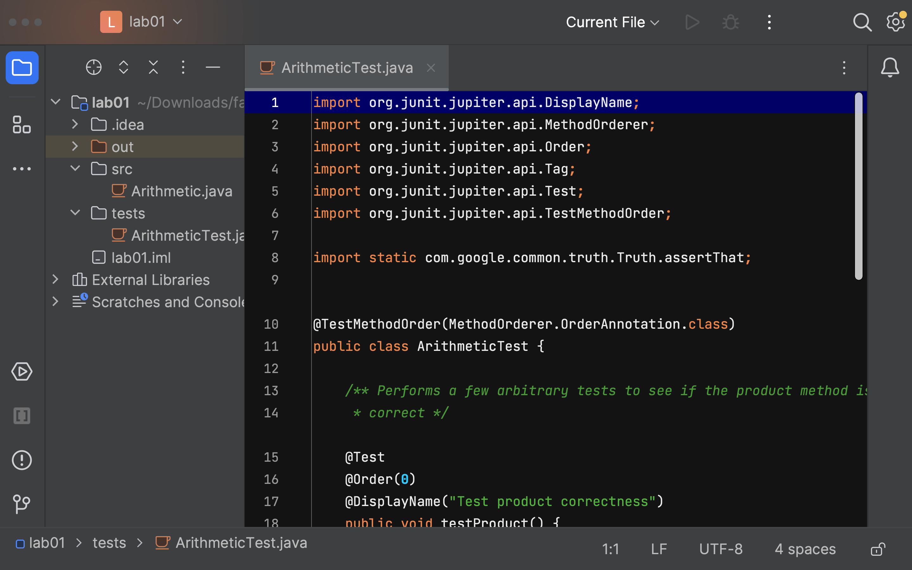

If you see those coffee cup icons, we need to tell IntelliJ where to find your Java files.

1. Right-click the `src` folder &#8594; "Mark Directory as" &#8594; "Sources Root":

    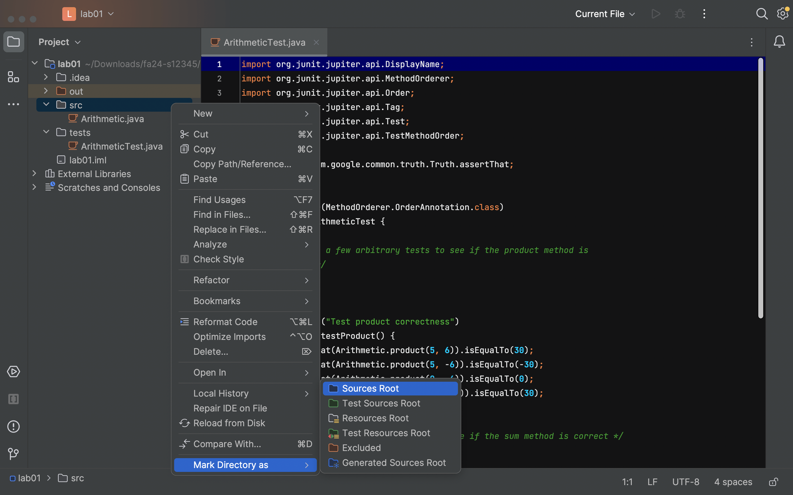

2. Then, right-click the `tests` folder &#8594; "Mark Directory as" &#8594; "Tests Root":

    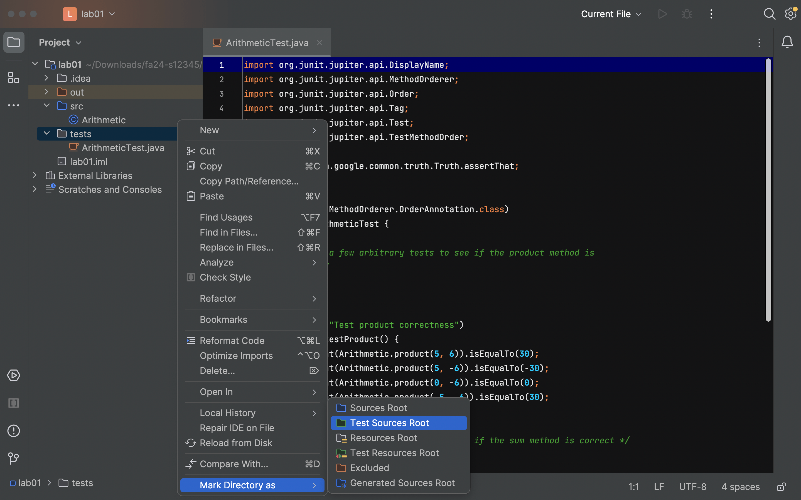

3. To check that everything worked, go to "File" &#8594; "Project Structure" &#8594; "Modules":

    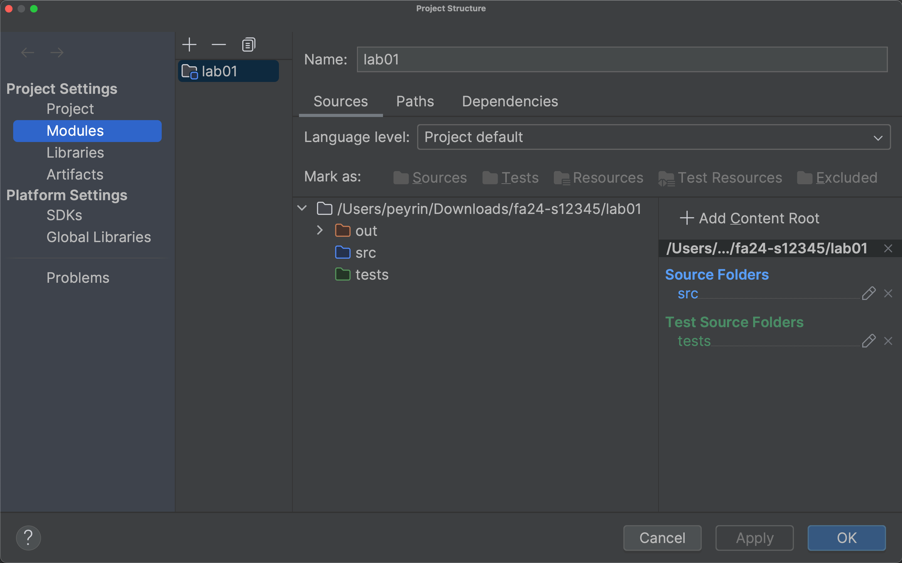

    In the right sidebar, make sure that you see `src` under "Source Folders", and you see `tests` under "Test Source Folders."

    If everything looks good, press "OK" to exit the Project Structure menu.

At this point, you should see a C icon next to your Java files, instead of the coffee cup icons. Also, the `src` folder should be blue, and the `tests` folder should be green:

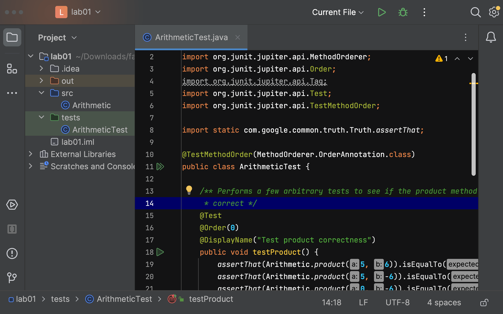

If all is fixed, you should be able to run your programs now!

If things aren't fixed, try [Reopen Intellij](#reopen-intellij). If things still aren't fixed after that, try [the IntelliJ nuclear option](#the-intellij-nuclear-option).

## Import Libraries

**Problem**: Function names are in red, and when I try to run code, Java says that a package does not exist.

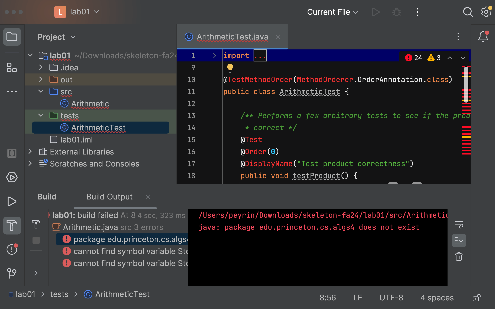

**Solution**: You need to import the libraries (`library-{{ site.semester }}`) for this project. Every time you start a new assignment (unfortunately, EVERY TIME) you must add the libraries again.

1. To add libraries, go to "File" &#8594; "Project Structures" &#8594; "Libraries."

2. Click the plus sign.

3. Select the library folder (e.g. `library-{{ site.semester }}`).

4. After you finish importing libraries, you should see this:

    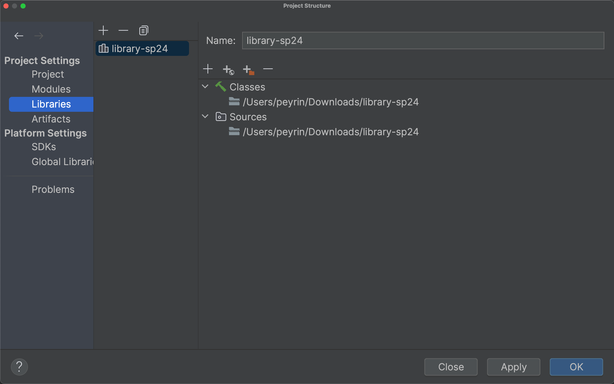

    Press "OK" to apply changes and exit the menu.

At this point, if all is fixed, the function names should no longer be red, and you should be able to run your programs now!

If things aren't fixed, try [Reopen Intellij](#reopen-intellij). If things still aren't fixed after that, try [the IntelliJ nuclear option](#the-intellij-nuclear-option).

## Set Output Path

**Problem**: You see an error message saying "The output path is not specified for module," like this:

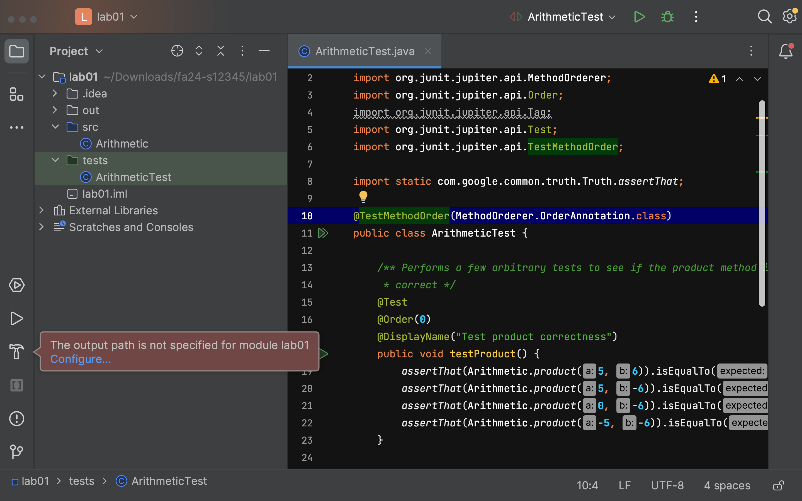

**Solution**: IntelliJ puts all the compiled Java `.class` files in a special folder called `out`. Usually, IntelliJ is able to determine where to put this folder, but sometimes it gets confused and needs your help.

1. You should see a filepath written in gray at the top of the left sidebar. In the picture above, the filepath is `~/Downloads/fa24-s12345/lab01`. Make a note of this.

2. Go to "File" &#8594; "Project Structures" &#8594; "Project."

3. In the "Compiler output" box, write down the filepath from earlier, but with an extra `/out` appended at the end. In this example, the output would be `~/Downloads/fa24-s12345/lab01/out`.

    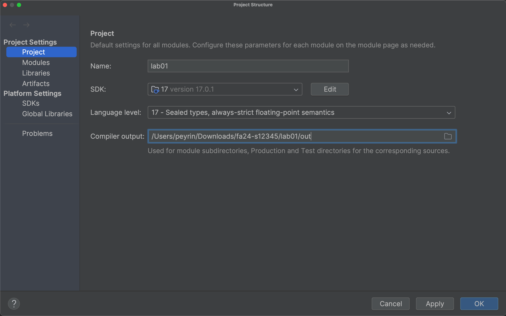

At this point, if all is fixed, the original "output path not specified" error message should no longer appear when you try to run your program.

If things aren't fixed, try [Reopen Intellij](#reopen-intellij). If things still aren't fixed after that, try [the IntelliJ nuclear option](#the-intellij-nuclear-option).

## Disable Git Plugin

**Problem**: You see a filename in red in the sidebar, like this:

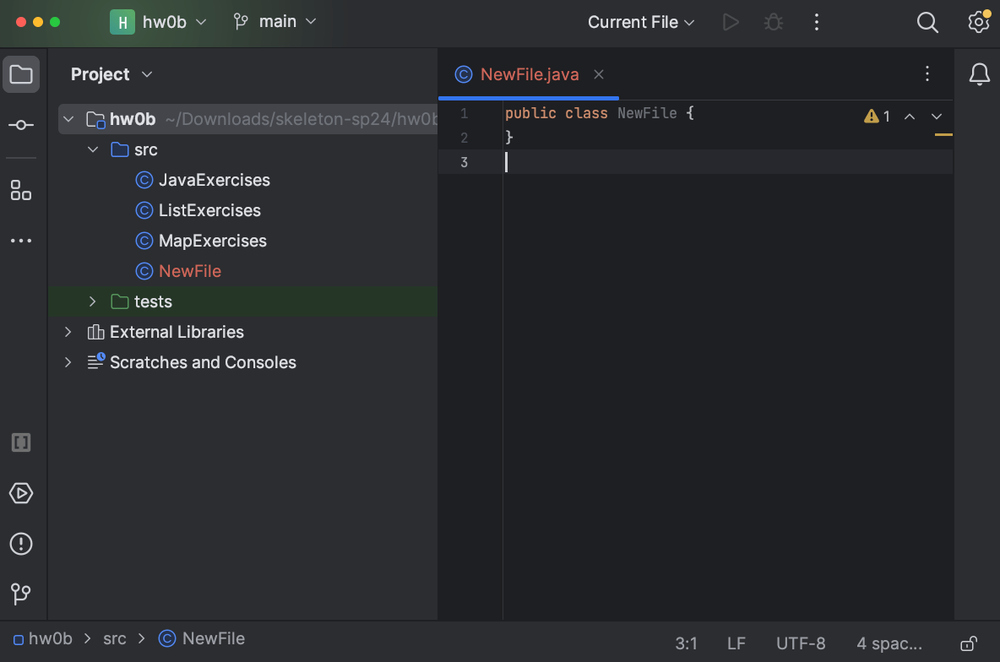

Or, you see a "Merging main" message in the top-left, like this:

**Solution**: You can safely ignore these messages. These are from IntelliJ's Git plugin, but in CS 61B, we don't use this plugin. We only support using Git through the terminal.

If you would like to disable the Git plugin to avoid seeing these messages, you can go to "IntelliJ IDEA" &#8594; "Settings" (on MacOS), or "File" &#8594; "Settings" (on Windows and Linux).

In the left sidebar, select "Plugins," and uncheck the bundled Git plugin:

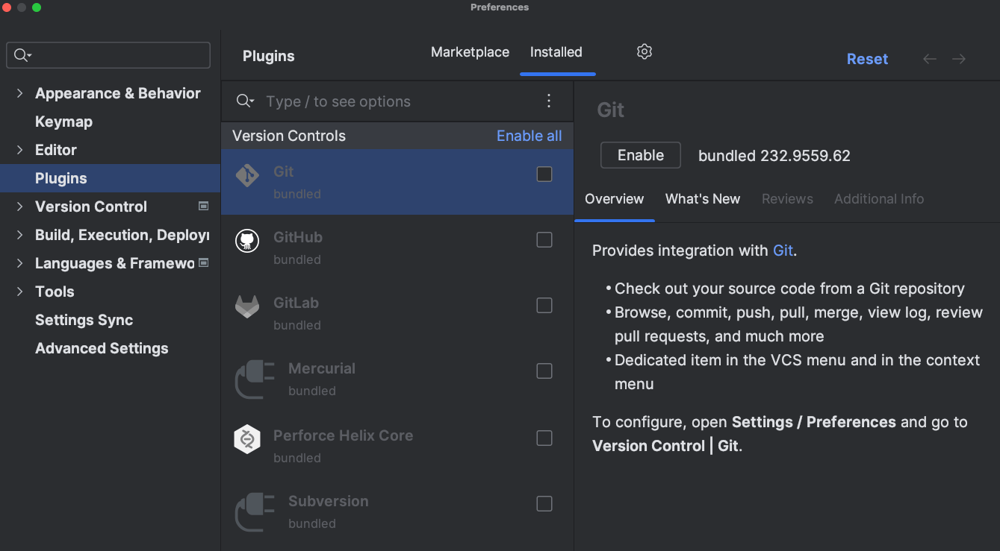

Then press "OK" to save your settings.

## Rebuild Project

Sometimes, we just need to ask IntelliJ to recompile your code from scratch.

To rebuild your code from scratch: "Build" &#8594; "Rebuild Project".

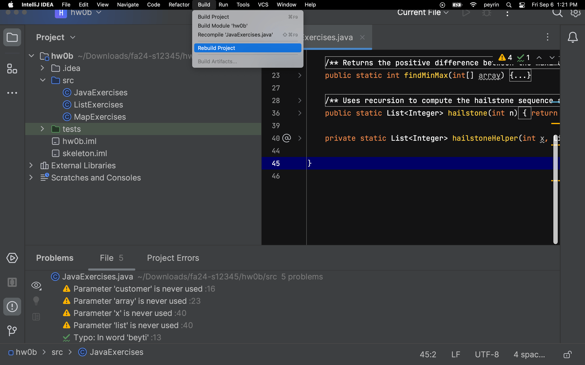

If things aren't fixed, try [Reopen Intellij](#reopen-intellij). If things still aren't fixed after that, try [the IntelliJ nuclear option](#the-intellij-nuclear-option).

## Reopen IntelliJ

Sometimes the easiest thing is to simply do it all over again. Even if you know you just did everything correctly, starting over very often just fixes the problem.

1. Close the project: "File"  &#8594; "Close Project".
2. Quit the IntelliJ application.
3. Re-open the IntelliJ application.
4. Click "Open" and select the correct folder (e.g. `lab01` or `proj0`).
5. If things still aren't fixed, try [the IntelliJ nuclear option](#the-intellij-nuclear-option).

## The IntelliJ Nuclear Option

Sometimes, the easiest thing is to simply do it ALL over again. Specifically, we need to purge Intellij's memory and make it forget that our project ever existed.

Intellij stores project information as `.idea` folders and `.iml` files. To make it forget our project, we'll be deleting those.

1.  Close the project: "File" &#8594; "Close Project."
2.  Quit IntelliJ.
3.  In File Explorer / Finder, go to the project folder.
4.  Now, you'll need to show hidden files, so that `.idea` and `.iml` show up.
    - [Guide for Windows 10 and below.](https://support.microsoft.com/en-us/windows/show-hidden-files-0320fe58-0117-fd59-6851-9b7f9840fdb2)
    - [Guide for Windows 11.](https://pureinfotech.com/show-hidden-files-windows-11-file-explorer/)
    - [Guide for Mac.](https://www.pcmag.com/how-to/how-to-access-your-macs-hidden-files). Usually you just need to press Command + Shift + . (period).
5.  Delete the `.idea` folder and any `.iml` files you see.
6.  Re-open the project in IntelliJ. You will need to follow Steps 1-6 of the [Assignment Workflow Guide](/resources/guides/assignment-workflow/) again.

At this point, the project should look normal. However, if things look wrong, you may need to redo [Mark Directories](#mark-directories), [Import Libraries](#import-libraries), and/or [Set Output Path](#set-output-path).